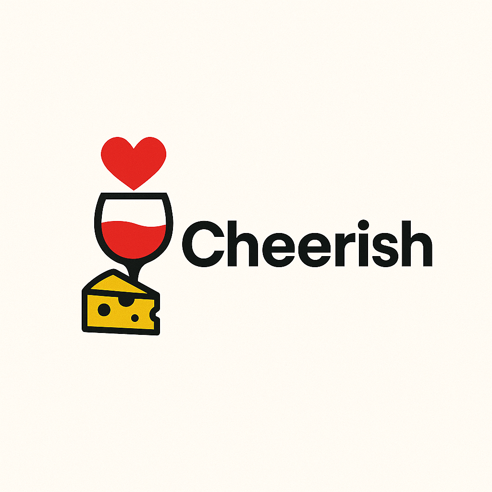
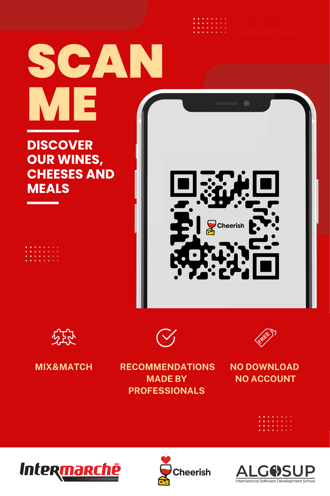

    

  <a href="#features">Features</a> • 
  <a href="#manifest">Manifest</a> • 
  <a href="#contributing">Contributing</a> • 
  <a href="#license">License</a> • 
  <a href="#authors">Authors</a> • 
  <a href="#contributing">Cheerish</a>

 

This project is a web application developed using Bubble that allows users to match wines and cheese with local dishes. The application provides a user-friendly interface for searching and filtering products, as well as displaying detailed information about each product and product combination.

## Features

- Personalised product recommendations based on user preferences and dietary restrictions,
- Search and filter products by various criteria (e.g., type, region, price),
- Detailed product information, including images, descriptions, and nutritional information,
- User-friendly interface with intuitive navigation and layout,
- Mix and match feature to suggest wine and cheese pairings with local dishes.

## Manifest

- [Functional Specification](./documents/functional/FunctionalSpecifications.md)
- [Technical Specification](./documents/technical/TechnicalSpecifications.md)
- [Test Plan](./documents/QA/TestPLan.md)
- [Test Cases](./documents/QA/TestCases.md)
- [Weekly Reports](./documents/management/weeklyReports)
- [User Manual](./documents/user-manual/)

## Contributing

We welcome contributions! Feel free to submit issues, suggest new features, or open pull requests.

## License

[BSD 3.0 License](/LICENSE.md)

## Authors

Team 4:

- [Clementine CUREL](https://www.linkedin.com/in/clementinecurel/) - Project Manager
- [Thibaud MARLIER](https://www.linkedin.com/in/thibaudmarlier/) - Program Manager
- [Jason GROSSO](https://www.linkedin.com/in/jason-grosso-847b39251/) - Technical Lead
- [Elone DELILLE](https://www.linkedin.com/in/elonedelille/) - Quality Assurance
- [Emilien CHINSY](https://www.linkedin.com/in/emilien-chinsy-5a794632b/) - Software Engineer
- [Robin GOUMY](https://www.linkedin.com/in/robin-goumy-66452832a/) - Technical Writer

## Cheerish

[Catalogue Link](https://cheerish-93469.bubbleapps.io/version-test/qr_code_in_cheese_aisle?debug_mode=false)

    

