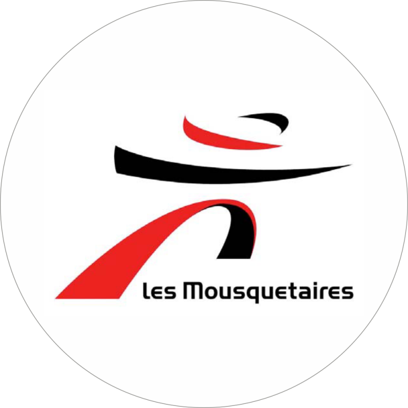
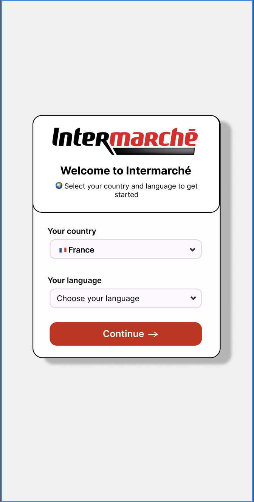
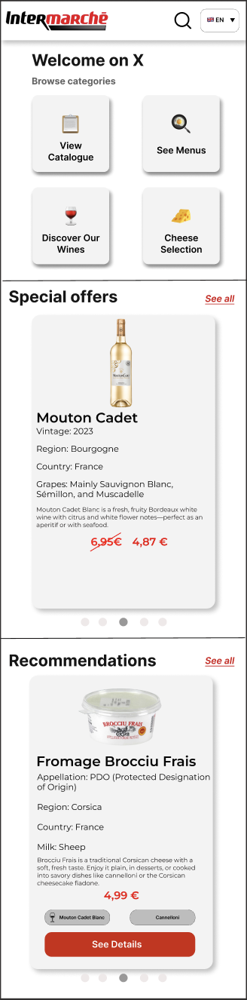
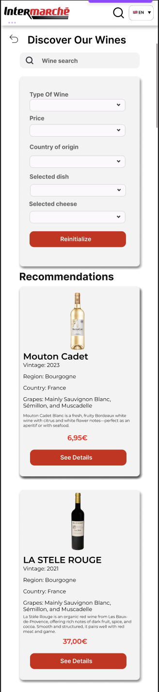
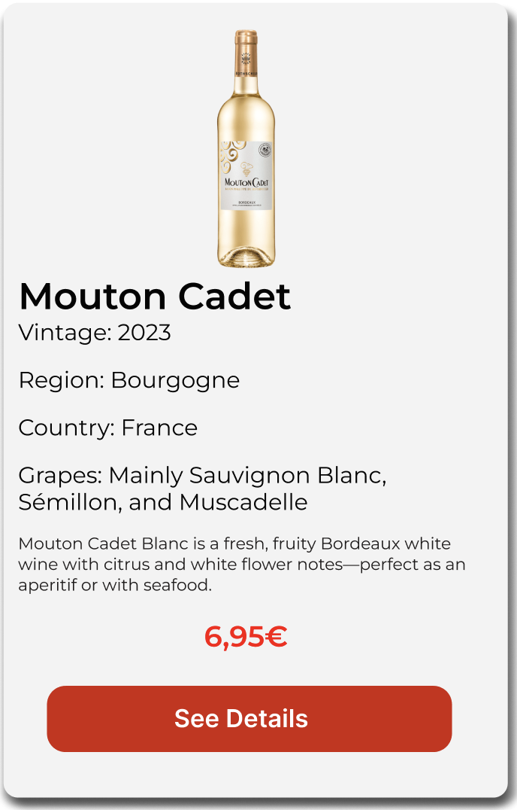
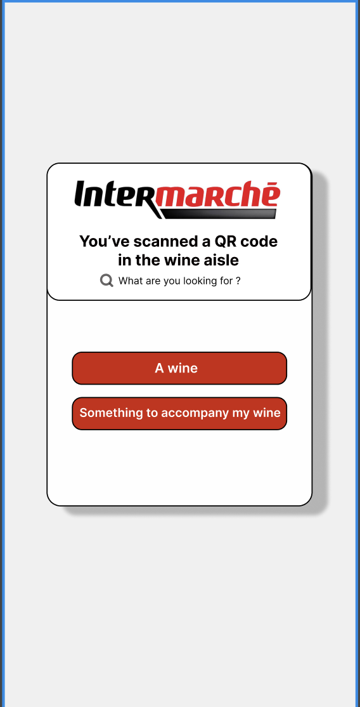
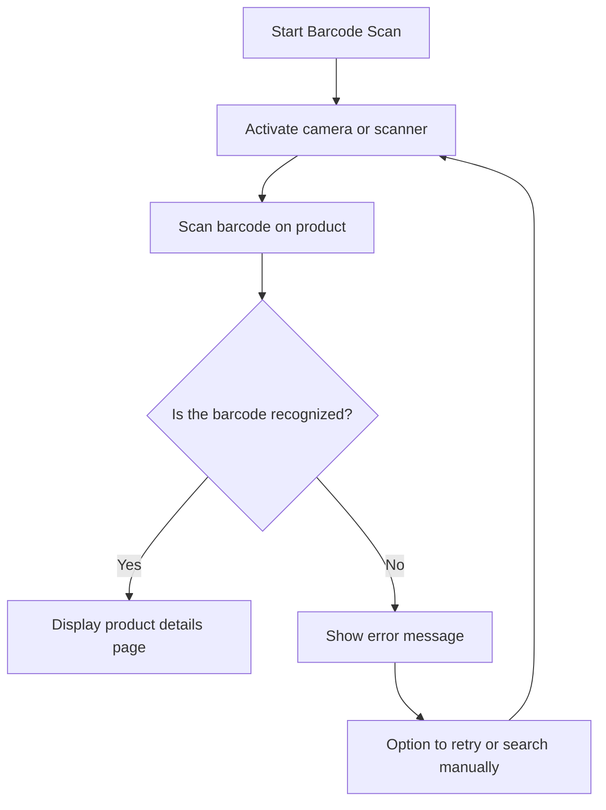
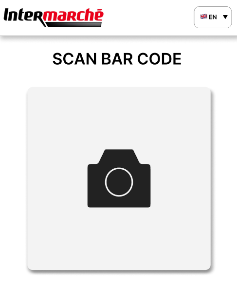
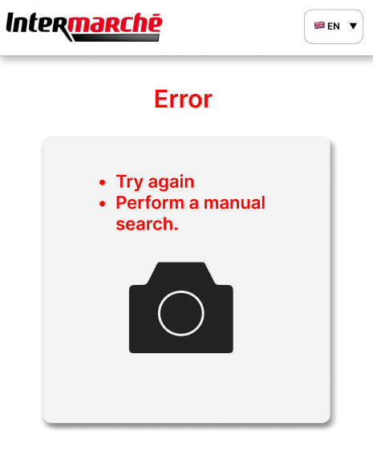
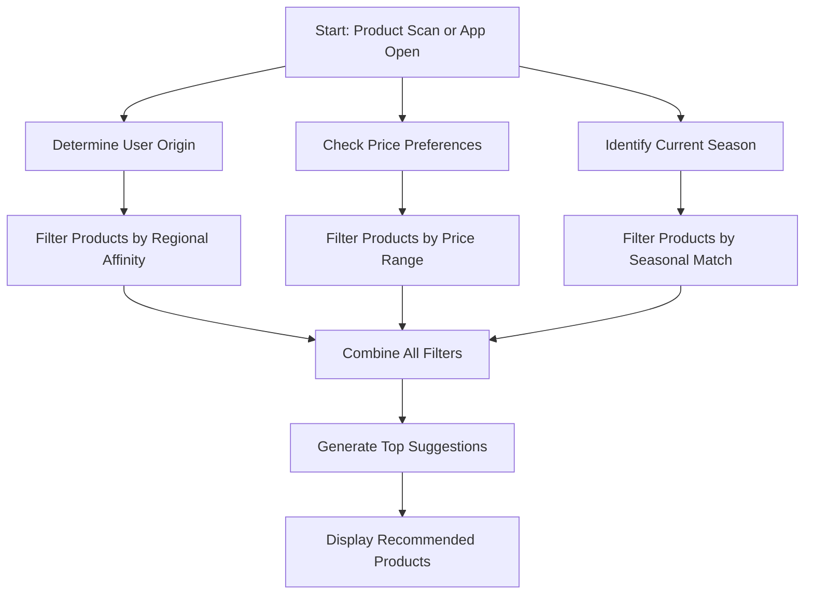

# Functional Specifications – Team 4 - Cheerish

## Table of Contents

- [Functional Specifications – Team 4 - Cheerish](#functional-specifications--team-4---cheerish)
  - [Table of Contents](#table-of-contents)
  - [Introduction](#introduction)
    - [Project Overview](#project-overview)
    - [Project Definition](#project-definition)
      - [Vision](#vision)
      - [Market Analysis](#market-analysis)
      - [Scope](#scope)
      - [Deliverables](#deliverables)
  - [Project Organization](#project-organization)
      - [Project Representatives](#project-representatives)
      - [Team \& Roles](#team--roles)
      - [Stakeholders](#stakeholders)
    - [Risks](#risks)
    - [Resources](#resources)
      - [Team](#team)
      - [Client](#client)
      - [Technology](#technology)
      - [Database](#database)
    - [Assumptions](#assumptions)
    - [Constraints](#constraints)
  - [Audience \& Use Cases](#audience--use-cases)
    - [Target Audience](#target-audience)
      - [Tourists](#tourists)
      - [Casual Shoppers](#casual-shoppers)
      - [Wine Lovers](#wine-lovers)
      - [Wine Newbies](#wine-newbies)
  - [UI/UX](#uiux)
    - [Graphic Charter](#graphic-charter)
    - [Logotype](#logotype)
      - [Cheerish Logo](#cheerish-logo)
      - [Base Logo](#base-logo)
      - [Intermarché Super Logo](#intermarché-super-logo)
      - [Round Intermarché Logo](#round-intermarché-logo)
    - [Logo Usage Guidelines](#logo-usage-guidelines)
    - [Logo Liability Disclaimer](#logo-liability-disclaimer)
    - [Color Palette](#color-palette)
    - [Mockups](#mockups)
      - [Sign-Up Page](#sign-up-page)
      - [Menu Page](#menu-page)
      - [Discovery Pages](#discovery-pages)
      - [Product Card](#product-card)
      - [Product Page](#product-page)
  - [Functional Requirements](#functional-requirements)
    - [Multilingual Support](#multilingual-support)
    - [QR Code Accessibility](#qr-code-accessibility)
      - [Example: Wine Aisle QR Code Flow](#example-wine-aisle-qr-code-flow)
      - [If the user chooses "Something to accompany my wine"](#if-the-user-chooses-something-to-accompany-my-wine)
      - [If the user chooses "Find a wine"](#if-the-user-chooses-find-a-wine)
    - [Search Mechanic](#search-mechanic)
    - [List Of Products](#list-of-products)
      - [Meals](#meals)
      - [Wines](#wines)
      - [Cheeses](#cheeses)
    - [Product Tags](#product-tags)
    - [Research Filters](#research-filters)
    - [Bar-Code Scanner](#bar-code-scanner)
    - [Recommendation Algorithm](#recommendation-algorithm)
      - [Functional Criteria](#functional-criteria)
      - [Example Use Case](#example-use-case)
      - [Recommendation Flow](#recommendation-flow)
      - [Cultural Taste Preferences](#cultural-taste-preferences)
    - [Local Product Spotlight](#local-product-spotlight)
  - [Non-Functional Requirements](#non-functional-requirements)
    - [Performance](#performance)
    - [Scalability](#scalability)
    - [Reliability](#reliability)
    - [Accessibility](#accessibility)
  - [Recommended Minimum Hardware Requirements](#recommended-minimum-hardware-requirements)
  - [Future Improvements](#future-improvements)
    - [Integration of Special Offers](#integration-of-special-offers)
    - [User Reviews and Product Ratings](#user-reviews-and-product-ratings)
    - [In-Store Product Location Guidance](#in-store-product-location-guidance)
  - [Legal \& Compliance](#legal--compliance)
    - [Data Protection and Privacy](#data-protection-and-privacy)
  - [Conclusion](#conclusion)

---

## Introduction

This document outlines the **functional specifications** for the development of a mobile web application for [Intermarché](https://www.intermarche.com/?srsltid=AfmBOop3uKBkrZ9x8Szj8EtpgHOqzuk_bHP3x1af4_9TrFf_640On9RY) named Cheerish.
Its purpose is to clearly define the project's requirements, scope, and objectives, ensuring that all stakeholders share a unified understanding of what is being developed.

### Project Overview

The goal of this project is to deliver a user-friendly **mobile web application** for Intermarché customers, providing personalized assistance when choosing wine and/or cheese upon entering the store.
The app will suggest the most suitable wine or cheese based on the user's dish, taste preferences, or filters. It aims to simplify the selection process and enhance customer satisfaction by offering tailored recommendations.

---

### Project Definition

#### Vision

Our vision is to develop an **open-source mobile web application** as a proof of concept for Intermarché, designed to:

- Simplify the pairing of food with wine and cheese
- Highlight and promote **local producers**
- Encourage discovery of **regional specialties**
- Provide **personalized recommendations** based on user preferences and origin
- Be accessible to a **multilingual audience**
- Attract more customers and **increase in-store sales**
- Feature an **intuitive and inclusive interface** for all adult users
- No-need to **create an account**

#### Market Analysis

A similar recommendation system already exists on Intermarché’s official website: [Wine Selection Tool](https://www.intermarche.com/recherche/vin). However, after evaluating its current features, we have identified several areas where our mobile web application can offer significant improvements and differentiation:

- **No Account Required** – Users can access recommendations without the need to create an account, lowering the barrier to entry.
- **Enhanced User Experience** – A more intuitive and streamlined interface optimized for mobile devices.
- **Multilingual Support** – The web application will be accessible in multiple languages, ensuring usability for a wider audience, including tourists and non-native speakers.
- **Personalized Recommendations** – Tailored suggestions based on individual preferences, tastes, and user input.
- **Value-Added Features** – Additional options such as pairing suggestions, local producer highlights, and dish-based recommendations that go beyond the existing tool.
- **Bar-code scanner** - Bar-code reader that sends the user to the product page.

These improvements aim to create a unique, user-focused experience that not only enhances customer satisfaction but also strengthens Intermarché’s digital ecosystem.

#### Scope

This project focuses on developing a **mobile web application** for Intermarché that enhances the customer shopping experience by helping users select the most appropriate wine and/or cheese based on their dish, preferences, or filters. The web application will serve as a **proof of concept** and prioritize ease of use, personalization, and support for local products.

**In Scope:**

- Development of a **mobile-first web application** for Android and iOS
- **Recommendation engine** for pairing wine and cheese with dishes
- **User preference filtering** (taste, region, type, etc.)
- **Multilingual support** (French, English, German, Spanish)
- **Highlighting local producers** and regional specialties
- Simple **onboarding without requiring an account**
- Basic **mockups and UI/UX design**
- Integration with a **test database** of wine, and cheese provided by Saint-Rémy de Florence Intermarché
- Delivery of an **open-source proof of concept**

**Out of Scope:**

- Full integration with Intermarché’s existing database or e-commerce system
- Loyalty program integration or account-based features
- Payment or ordering functionality
- Advanced AI or machine learning recommendation systems
- Offline mode or heavy caching for disconnected environments

This scope ensures a focused and achievable MVP (Minimum Viable Product), allowing Intermarché to evaluate the concept's value and gather user feedback for future development.

**Technology Used:**

The product is developed using the no-code tool Bubble.io.

#### Deliverables

| Deliverables             | Date       |
| ------------------------ | ---------- |
| Functional Specification | 16/05/2025 |
| Technical Specification  | 28/05/2025 |
| Test Plan                | 06/06/2025 |
| User Manual              | 16/06/2025 |
| Code                     | 16/06/2025 |

---

## Project Organization

#### Project Representatives

| Entities                           | Representative                                                                     |
| ---------------------------------- | ---------------------------------------------------------------------------------- |
| Intermarché's Representative       | [Célia Moustier](moustier09@hotmail.fr)                                            |
| Intern Aisle Responsible           | [Chrys Cadeau](chryscadeau13@gmail.com)                                            |
| [ALGOSUP](https://www.algosup.com) | [Franck Jeannin](franck.jeannin@algosup.com)                                       |
| Team 4                             | [Clementine Curel](https://www.linkedin.com/in/clementinecurel/) - Project Manager |

#### Team & Roles

| Full Name        | Role              | Role Description                                                         | Contact                                                           |
| ---------------- | ----------------- | ------------------------------------------------------------------------ | ----------------------------------------------------------------- |
| Clementine Curel | Project Manager   | Responsible for project planning, coordination, and communication        | [LinkedIn](https://www.linkedin.com/in/clementinecurel/)          |
| Thibaud Marlier  | Program Manager   | Ensures project meets expectations; oversees design and functional specs | [LinkedIn](https://www.linkedin.com/in/thibaudmarlier/)           |
| Jason Grosso     | Technical Lead    | Oversees technical aspects, including architecture and implementation    | [LinkedIn](https://www.linkedin.com/in/jason-grosso-847b39251/)   |
| Elone Delille    | Quality Assurance | Ensures quality of deliverables and adherence to requirements            | [LinkedIn](https://www.linkedin.com/in/elonedelille/)             |
| Emilien Chinsy   | Software Engineer | Develops the mobile web application and the algorithm                    | [LinkedIn](https://www.linkedin.com/in/emilien-chinsy-5a794632b/) |
| Robin Goumy      | Technical Writer  | Responsible for the User Manual and UX                                   | [LinkedIn](https://www.linkedin.com/in/robin-goumy-66452832a/)    |

#### Stakeholders

| Stakeholders           | Interest                                                |
| ---------------------- | ------------------------------------------------------- |
| Intermarché's customer | Primary beneficiary                                     |
| Intermarché            | Project initiator and secondary beneficiary             |
| ALGOSUP                | Technology provider, second project initiator           |
| ALGOSUP's students     | Project contributors, developers, testers, designers... |

### Risks

| Risk                               | Consequences                                       | Likelihood | Impact | Mitigation                                                                                       |
| ---------------------------------- | -------------------------------------------------- | ---------- | ------ | ------------------------------------------------------------------------------------------------ |
| Delayed Client's Response          | Deadlines not respected                            | High       | High   | Plan messages in advance, schedule regular meetings, and consolidate questions into one message. |
| Limited Technology Stack           | Functionalities hard/impossible to implement       | High       | High   | Plan development in advance, close collaboration with Technical Leader                           |
| Inaccurate Pairing Recommendations | Poor user experience, low app credibility          | Medium     | High   | Use validated data sources, enable user feedback, consult domain experts                         |
| Ambiguity in Feature Definitions   | Misaligned expectations, rework and delays         | Medium     | High   | Clearly define user stories and acceptance criteria                                              |
| Overcomplexity in UI               | Users abandon app due to confusion                 | Medium     | Medium | Prioritize simplicity, offer "basic" and "advanced" modes                                        |
| Incorrect or Missing Product Data  | Unreliable results, limited functionality          | Medium     | High   | Use reliable databases, allow user corrections with moderation                                   |
| Lack of Domain Expertise           | Incorrect pairing logic, user mistrust             | Medium     | High   | Consult culinary experts or trusted sources                                                      |
| Performance Bottlenecks            | Slow app performance, especially on mobile         | Medium     | Medium | Optimize database and API calls, test on low-spec devices                                        |
| Feature Creep                      | Project delays, diluted focus                      | Medium     | High   | Stick to MoSCoW prioritization, defer non-core features                                          |
| No Mechanism for Feedback/Updates  | App becomes outdated or unresponsive to user needs | Low        | Medium | Add user feedback forms, analytics, and data update mechanisms                                   |

### Resources

#### Team

A team of 6 members, each with clearly defined roles and responsibilities.

- **Estimated Project Duration:** 110 hours
- **Estimated Total Workload:** 660 man-hours

#### Client

- Contact has been established with the **Intermarché store in Issoudun** to test the product on site.
- Communication is also in progress with the **department manager at Saint-Rémy-de-Provence** for further product validation.

#### Technology

- Supervised access to **Bubble.io** with support from an instructor for guidance and troubleshooting.

#### Database

You can find the database [here](../../data/Data%20-%20Wine%20and%20Cheese.xlsx)

- The client has provided an Excel database containing detailed information about wines and cheeses available in-store.

The database includes:

- Product barcodes in the following formats:

  - `ITM8`
  - `EAN PRIO`

- Product name
- Region of origin
- Country of origin
- Product type:

  - Cheese
  - Yogurt
  - Red Wine
  - White Wine
  - Rosé Wine
  - Sparkling Wine
  - Other dairy products

- Milk type (for cheese/dairy products)

---

### Assumptions

- The client will provide timely feedback during key development milestones.
- The database provided is accurate, up-to-date, and reflective of actual stock.
- Users will access the web application primarily on modern web browsers with internet connectivity.
- Bubble.io offers all the required features to build the desired functionalities without needing external integrations.
- The test environments provided by Intermarché (Issoudun and Saint-Rémy-de-Provence) will support functional validation of the prototype.
- Product classifications (e.g., wine types, milk types) are consistent across all entries in the database.

---

### Constraints

- The project must be developed using **Bubble.io**, as per the client’s technological preference.
- It must remain **open-source** to ensure transparency and encourage community contributions.
- All features must be aligned with the **client’s functional and aesthetic requirements**.
- The final product must adhere to **Intermarché’s brand values**, including quality, simplicity, and accessibility.

---

## Audience & Use Cases

### Target Audience

#### Tourists

**Age Range:** 25–60

**Persona Name:** _Anna, the Curious Traveler_

**Description:**
Anna is a tourist visiting France, eager to explore French culture through its gastronomy. She doesn’t speak fluent French and is unfamiliar with local wine or cheese. She often shops at Intermarché for convenience and wants help choosing authentic regional products.

**How They’ll Use the App:**
Anna opens the app in-store, sets her preferred language to English, and browses local wine and cheese pairings recommended for regional dishes. She filters by “local products” and gets insights into producers, allowing her to bring a taste of France home.

---

#### Casual Shoppers

**Age Range:** 30–55

**Persona Name:** _Marc, the Busy Parent_

**Description:**
Marc is a working parent who shops weekly at Intermarché. He’s not a wine connoisseur but wants to make nice meals for his family. Convenience and speed matter most to him.

**How They’ll Use the App:**
Marc uses the app to quickly match wine or cheese with meals he already plans to cook. He appreciates the simple interface, no-login access, and dish-based suggestions like “Which wine goes with lasagna?”

---

#### Wine Lovers

**Age Range:** 35–65

**Persona Name:** _Claire, the Wine Enthusiast_

**Description:**
Claire has a deep appreciation for wine and occasionally hosts tastings. She values quality, regional authenticity, and food pairing precision. She enjoys exploring lesser-known wines and artisanal cheeses.

**How They’ll Use the App:**
Claire uses advanced filters to explore pairing combinations, discover hidden gems from local producers, and save preferred pairings. She might share her recommendations with friends and even plan tasting menus with the help of the app.

---

#### Wine Newbies

**Age Range:** 18–30

**Persona Name:** _Lucas, the Curious Student_

**Description:**
Lucas is new to wine and cheese culture but wants to learn. He’s open to trying new things but often feels overwhelmed by the selection in-store.

**How They’ll Use the App:**
Lucas enters a few taste preferences (fruity, light, etc.) and selects a dish he plans to cook with friends. The app gives him easy, beginner-friendly pairings with short descriptions and explanations — helping him gain confidence with each use.

---

## UI/UX

### Graphic Charter

This project follows the official Intermarché graphic charter to ensure visual consistency and brand recognition. The following elements reflect the branding guidelines.

---

### Logotype

The web application uses official Intermarché logos provided under the brand’s existing identity. Below are the logos available for use:

---

#### Cheerish Logo

Here's a corrected and improved version of your section, with added explanation for the design elements of the logo:

Cheerish is the name and logo our team created specifically for this project.

The logo was designed to visually represent the core values and purpose of the application. It includes:

- **A piece of cheese**, symbolizing one of the two main product categories the app focuses on.
- **A wine glass**, representing the second core product and evoking moments of tasting and enjoyment.
- **A heart**, placed above the glass to express warmth, appreciation, and the emotional connection people often have with good food and shared experiences.
- **The name _Cheerish_**, a blend of the words _cheer_ and _cherish_, captures the spirit of celebration, discovery, and the appreciation of fine wine and cheese.

Together, these elements embody the user experience we aim to deliver—personalized, joyful, and rooted in cultural and culinary appreciation.

#### Base Logo

This is the main Intermarché logo, used primarily for branding, advertising, and digital web applications.

---

#### Intermarché Super Logo

This logo represents **Intermarché Super**, supermarkets with a strong focus on fresh food products, tailored to local clientele.
It is the **primary logo** for this project, as the main client is **Intermarché Super in Saint-Rémy-de-Provence**.

---

#### Round Intermarché Logo

This round version of the logo is ideal for **loading pages** or compact areas where a circular design is more fitting.

---

### Logo Usage Guidelines

According to Intermarché’s official branding policy:

- The logo must **not** be altered in shape, proportions, or color.
- A **minimum usage size of 25mm** is required for optimal readability.
- Logos must be displayed on a **white background** to maintain visual clarity.

---

### Logo Liability Disclaimer

> **Disclaimer:**
> All logos used in this project are the intellectual property of **Intermarché** and its affiliates.
> They are used **exclusively** for educational, prototyping, or demonstrative purposes, and **not for commercial redistribution**.
> Our team claims **no ownership** over these visual assets.

---

### Color Palette

The application’s color scheme aligns with Intermarché’s official brand colors to maintain consistency.

| Color     | RGBA Value         | Example                                       |
| --------- | ------------------ | --------------------------------------------- |
| **Red**   | 226, 0, 26, 100    |      |
| **Black** | 26, 23, 26, 100    |  |
| **Grey**  | 220, 220, 220, 100 |    |

---

### Mockups

A visual prototype of the application has been designed using Figma. You can view the interactive mockup [here](https://www.figma.com/design/FiDisAv5pKKYsvQBODIIYx/BUBBLE-INTER?node-id=0-1&t=5USWv2xX2utpUy6t-1).

This mockup outlines the core user flows and primary pages of the application, with a focus on intuitive navigation and an engaging user experience.

Though, screenshots taken from such mockup are subject to change and are explanatory, do not focus too much on the visuals but rather on the functionalities.

---

#### Sign-Up Page

Although not a traditional user sign-up, this onboarding process helps tailor the experience by understanding the user’s background. The choices made here are essential for personalized recommendations — for instance, a user from the United Kingdom might receive different pairings than one from Germany. More details can be found in the [Recommendation Algorithm](#recommendation-algorithm) section.

**Information Collected:**

- The user's country of origin — used to refine recommendation logic
- The language spoken — used for full interface translation

**UI Elements:**

- Two dropdown fields: one for selecting the country, and one for the preferred language
- A "Continue" button that is **disabled** by default and becomes **active** only when both fields are filled

**Available Countries:**

- France
- United Kingdom
- Spain
- Germany
- Italy
- China
- Other

Supported languages can be found in the [Multilingual Support](#multilingual-support) section.

**Button Behavior:**

- **Disabled state:** Grey background, inactive

- **Enabled state:** Red background, active

These button colors are defined in the [Color Palette](#color-palette) section.

**Button Values**

- Height: 30px
- Width: 195px
- Centered
- Padding: 15px

#### Menu Page

The Menu Page serves as the **Home Page** of the application. It is the main interface the user interacts with and offers quick access to key features and content.

The page is composed of four main sections:

1. **Header**

The header includes the following elements:

- The application’s logo
- A magnifying glass icon representing the [Search Mechanic](#search-mechanic) functionality
- A language switcher button, as described in the [Multilingual Support](#multilingual-support) section

2. **Browse Categories**

This section is designed to guide the user through available options and includes:

- A friendly welcome message
- A brief explanatory sentence encouraging exploration of the platform
- Four action buttons leading to various discovery pages:

  1. **See Menus** – Redirects to a complete list of available menus
  2. **Discover Our Wines** – Displays the full wine selection
  3. **Cheese Selection** – Presents the complete list of cheeses
  4. **View Catalogue** – Shows all available products, including menus, cheeses, and wines

> **Note:**
> These four buttons lead to what are referred to as **Discovery Pages**. You can find more information in the [Discovery Pages](#discovery-pages) section.

3. **Mix & Match**

_To be defined._
This section will allow users to combine products (e.g., wine and cheese) for personalized pairings.

4. **Recommendations**

This section includes personalized product suggestions based on user preferences, as detailed in the [Recommendation Algorithm](#recommendation-algorithm) section. It contains:

- A horizontally scrollable carousel with 2–5 product recommendations
- Product cards that include:

  - [Product Tags](#product-tags)
  - Product price
  - A brief description
  - A call-to-action button linking to the full [Product Page](#product-page)

  

#### Discovery Pages

Discovery Pages serve as the main category pages for product browsing. These categories include:

- Meals
- Wines
- Cheeses

Each page acts as a showcase for the respective category, displaying all available products along with relevant information.

The pages are composed of the following sections:

1. **Header**

   - Identical to the header described in the [Menu Page](#menu-page) section.
   - Contains the logo, search icon, and language selection button.

2. **Back Button**

   - A simple button that returns the user to the Menu Page.

3. **Search Bar**

   - A minimal design with a magnifying glass icon and input field.
   - Enables users to search for specific products or refine results alongside filter options.
   - Example: typing "white wine" returns only white wines.

4. **Filters**
   Filters allow users to narrow down their product search. Filter options include:

   - **Type of Wine** or **Type of Milk (for cheeses)** – See [Research Filters](#research-filters) for more details

   - **Price Range**

     - €0 to €5
     - €5 to €15
     - Over €15

   - **Country of Origin**

   - **Selected Dish** – The user selects a dish they wish to prepare; the system recommends suitable wines or cheeses.

   - **Selected Cheese** – The user selects a cheese they have; the system suggests compatible dishes or wines.

   - **Selected Wine** – The user selects a wine they have; the system recommends complementary dishes or cheeses.

   - **Reset Button** – Reinitializes all filters to their default state.

   > **Note:**
   > The "Selected ..." filters require the user to choose from products already present in the database (external products are not supported).
   > These filters will appear as dropdowns with search functionality to simplify selection.

5. **Recommendations Section**

   - Displays product cards based on the applied filters.
   - If no filters are applied, the full list of products in the selected category is shown.

  

#### Product Card

Product Cards highlight individual products across various pages. They are designed to present essential information clearly and attractively. Below is the design reference:

  

Each card includes:

- An image of the product
- Product name
- [Product Tags](#product-tags)
- A short description (maximum 30 words)
- Price
- A **See Details** button that links to the product’s dedicated page

**Design Specifications:**

- Rounded corners: 7°
- Black drop shadow
- Height: 40% of the screen height
- Width: 80% of the screen width
- Background color: Grey

#### Product Page

---

## Functional Requirements

### Multilingual Support

- **Functionality:**
  The mobile application must be available in multiple languages.

- **Details:**

  - The following languages must be supported:

    - French
    - English
    - Spanish
    - German
    - Italian
    - Chinese

  - Additional languages can be supported, but are not mandatory.
  - The entire application interface must be fully translated automatically when a language is selected.

---

### QR Code Accessibility

- **Functionality:**
  The application should be accessible by scanning a QR code.

- **Details:**

  - Three QR codes will be placed in the store:

    - At the store entrance
    - Near the wine aisle
    - Near the cheese aisle

  - Each QR code will redirect users to a **personalized interface** based on their location.

#### Example: Wine Aisle QR Code Flow

When the user scans the QR code near the **wine aisle**, the following screen appears:

The user is presented with two options:

1. **Find a wine** based on their preferences
2. **Something to accompany my wine** (such as food or cheese) for a wine they already have

---

#### If the user chooses "Something to accompany my wine"

- The user is prompted to input the **name of the wine** they have selected.
- After submission, they are redirected to the product page, which includes:

  - Suggested **dishes** that pair well with the wine
  - Recommended **cheeses** that complement both the wine and the chosen dish

> [!NOTE]
> More information about the recommendation system can be found in the [Recommendation Algorithm](#recommendation-algorithm) section.

---

#### If the user chooses "Find a wine"

- The user can apply filters to refine their search, including:

  - **Price range**
  - **Country of origin**
  - **Selected dish**
  - **Selected cheese**
  - **Additional preferences**

> [!NOTE]
> Details about filtering options can be found in the [Research Filters](#research-filters) section.

### Search Mechanic

### List Of Products

#### Meals

- **Functionality**:

  - Display traditional meals with matching wine and cheese recommendations.
  - [meal.json](../../data/meal.json)

- **Details**:

  - name
  - region
  - allergens
  - image
  - short description (FR/EN)
  - recommended wine types
  - recommended cheese tags

- **Example**:
  _Boeuf Bourguignon_
  → Wine: `Red`
  → Cheese: `hard cheese`, `cow cheese`

#### Wines

- **Functionality**:

  - Display wines and allow filtering by type, region, country, grape, or price.
  - [wines.json](../../data/wines.json)

- **Details**:

  - name
  - year
  - type (e.g. Red, White, Rosé)
  - region, country
  - grape varieties
  - price, rating
  - description (FR/EN)
  - image

- **Example**:
  _Domaine de Valdition Rosé Tradition_
  → Type: `Rosé`, Year: `2023`
  → Grapes: `Vermentino, Syrah, Grenache...`
  → Price: `10.5 €`

#### Cheeses

- **Functionality**:

  - Display cheeses and allow filtering by type, milk, region, or country.
  - [cheese.json](../../data/cheese.json)

- **Details**:

  - name
  - type (e.g. soft, hard, AOP...)
  - milk (e.g. cow, goat, sheep)
  - region, country
  - price
  - description
  - image

- **Example**:
  _Tomme de Savoie_
  → Type: `semi-hard cheese`, Milk: `cow`
  → Region: `Savoie`

### Product Tags

- **Functionality:**
  - The mobile application must display product tags to regroup products based on their type.
  - The tags must be **clickable** to filter the product list based on the selected tag.
- **Details:**
  - The tags must be displayed in a **horizontal list** format.
  - The tags must be **color-coded** to indicate the type of product they represent.
- **List of tags:**

| Category          | Tags                                                                                                                                                                                                                                                                                                                                                                                                                                                                    | Color Code                 |
| ----------------- | ----------------------------------------------------------------------------------------------------------------------------------------------------------------------------------------------------------------------------------------------------------------------------------------------------------------------------------------------------------------------------------------------------------------------------------------------------------------------- | -------------------------- |
| **Region**        | Alpilles, Alsace, Ardèche, Auvergne, Bandol, Basque Country, Bourgogne, Brittany, Camargue, Cévennes (Languedoc-Roussillon), Côtes de Provence, Dauphiné, EU, France, Gard, Île-de-France, Languedoc, Les Baux-de-Provence, Loire Valley, Lorraine, Luberon, Méditerranée, Normandie, Nord de l'Afrique, Pays Basque, Pays d'Oc, Périgord – Quercy, Poitou, Poitou–Charentes, Provence, Quercy, Rhône-Alpes, Savoie, South-West, Spain, Sud-Ouest, Var, Veneto, Ventoux | `#FFA07A` (Light Salmon)   |
| **Country**       | Cyprus, France, Greece, Italy, Spain                                                                                                                                                                                                                                                                                                                                                                                                                                    | `#FFD700` (Gold)           |
| **Meal Allergen** | Gluten, Lactose                                                                                                                                                                                                                                                                                                                                                                                                                                                         | `#FF4500` (Orange Red)     |
| **Wine Type**     | Rosé, White, Red, Sparkling, Fuzzy, Champagne                                                                                                                                                                                                                                                                                                                                                                                                                           | `#BA55D3` (Medium Orchid)  |
| **Wine Grape**    | Aligoté, Blend blanc espagnol, Blend blanc générique, Cabernet Sauvignon, Caladoc, Carignan, Cinsault, Chardonnay, Glera, Grenache, Grenache Blanc, Grenache Noir, Loin de l’Oeil, Mauzac, Merlot, Mourvèdre, Muscadelle, Pineau d’Aunis, Rolle, Roussanne, Shiraz/Syrah, Syrah, Tibouren, Ugni Blanc                                                                                                                                                                   | `#8FBC8F` (Dark Sea Green) |
| **Cheese Type**   | AOP goat cheese, AOP semi-soft cheese, Fresh cheese, Fresh goat cheese, Fresh log cheese, Goat cheese, Semi-hard cheese, Soft cheese, Triple-cream cheese, Yogurt                                                                                                                                                                                                                                                                                                       | `#87CEFA` (Light Sky Blue) |
| **Cheese Milk**   | Buffalo, Cow, Goat                                                                                                                                                                                                                                                                                                                                                                                                                                                      | `#F4A460` (Sandy Brown)    |
| **Season**        | Summer, Spring, Winter, Automn                                                                                                                                                                                                                                                                                                                                                                                                                                          | `#DAB1DA` (Light Purple)   |

### Research Filters

- **Functionality:**
  The mobile application must allow users to apply filters when searching for products

- **Details:**

  The Users can use the following filters to refine their search:

  - the type of product,
  - the price range,
  - the seasonality of the product,
  - the region or country of origin

  If the Users specified the type of of product they are looking for, they will have access to specific filters for that type of product:

  - for the **wine** type, the user unlock the following filters:
    - the color of the wine (red, white, rosé, sparkling),
    - the grape variety,
    - the sweetness level (dry, semi-dry, sweet),
    - the alcohol content
  - for the **cheese** type, the user unlock the following filters:
    - the milk type (cow, goat, sheep),
    - the texture (soft, hard, semi-soft),
    - the aging process (fresh, aged, blue-veined),
    - the flavor profile (mild, strong, spicy)
  - for the **meal** type, the user unlock the following filters:
    - the dieatary restrictions (vegetarian, vegan, gluten-free),
    - the region of origin (Provence, Bordeaux, ...)

### Bar-Code Scanner

- **Functionality:**

The application allows users to scan a product (wine or cheese) using its barcode. Upon scanning, the app automatically identifies the product and redirects the user to its associated product page. This page includes relevant information such as the product’s name, description, price, origin, and tasting suggestions.

- **User Flow:**

- **Benefits:**

  - Fast and intuitive access to product information.
  - Enhanced customer experience in-store or during demonstrations.
  - Time-saving and efficient browsing.

Once the product is successfully scanned, the user is redirected to the corresponding product page. For more information, refer to the [Product Page](#product-page) section.

### Recommendation Algorithm

The recommendation system provides personalized product suggestions based on contextual factors related to the user and their environment. Its goal is to enhance the relevance of the product discovery experience by suggesting items that align with user preferences and seasonal trends.

#### Functional Criteria

The algorithm will take the following criteria into account:

- **User's Origin**
  Regional and cultural backgrounds can influence taste preferences, consumption habits, and openness to new products.

- **Product Price Range**
  Recommendations will respect the user's purchasing habits or declared price sensitivity, offering items within a familiar or preferred price range.

- **Current Season**
  The system adapts to seasonal trends (e.g., lighter wines in summer, hearty cheeses in winter) to promote more timely and appropriate suggestions.

#### Example Use Case

A user from the South of France scans a mid-range cheese during winter. Based on this context, the app may suggest:

- A robust red wine from the same region.
- Other regional cheeses typically consumed in winter.
- Ongoing promotions for similar products within the same price range.

#### Recommendation Flow

#### Cultural Taste Preferences

The following table is based on market research and reflects general wine and cheese preferences by nationality:

| Nationality | Wine Preferences                                                                                         | Cheese Preferences                                                                                                                      |
| ----------- | -------------------------------------------------------------------------------------------------------- | --------------------------------------------------------------------------------------------------------------------------------------- |
| **British** | - Favor red wines (especially Bordeaux)   - Open to white and rosé during warmer months               | - Soft classics: Brie, Camembert   - Curious about strong types: Époisses, Roquefort   - Trend: Fromage Blanc, Chèvre             |
| **Spanish** | - Prefer red wines due to cultural familiarity   - Choose rosé or white wines in summer               | - Cheeses similar to Manchego: Comté, Tomme de Savoie, Ossau-Iraty                                                                      |
| **German**  | - Prefer white and rosé wines, especially dry varieties   - Enjoy Alsace wines like Riesling          | - Mild alpine cheeses: Emmental, Raclette, Munster                                                                                      |
| **Italian** | - Mainly red wines   - Also open to white and sparkling wines (e.g., Champagne)                       | - Soft and flavorful cheeses: Brie de Meaux, Roquefort, Reblochon                                                                       |
| **Chinese** | - Strong preference for red wines (especially Bordeaux)   - Growing interest in white/sparkling wines | - Prefer mild, approachable options: Brie, Camembert, Fromage Blanc   - Rising interest among youth in more diverse cheese varieties |

### Local Product Spotlight

---

## Non-Functional Requirements

### Performance

- The application must provide a smooth and responsive user experience across all supported devices.
- Page load times should not exceed **2 seconds** under normal network conditions.
- Recommendations and search results must be generated within **1 second** of user input.
- The backend must be capable of handling up to **100 concurrent users** without degradation in performance.

### Scalability

- The system must be scalable to support future growth, including:

  - An increasing number of users (up to 10,000+ active users).
  - Additional products (e.g., regional additions to wine and cheese).
  - Expansion into new countries or language support.

- The application architecture should support easy deployment to new shops or regions without structural changes.

### Reliability

- The system must achieve **99.5% uptime** on a monthly basis.
- All critical user data (e.g., preferences, search history, selections) should be saved reliably, even in case of crashes.
- A fallback mechanism must be in place to handle third-party service failures (e.g., translation, barcode scanning).

### Accessibility

- All functionalities should be usable by people with visual impairments, including support for:

  - Screen readers
  - High contrast modes
  - Keyboard navigation

- Texts should be legible across various screen sizes, and interactions must be intuitive and user-friendly.

---

## Recommended Minimum Hardware Requirements

_To be defined – specify device compatibility (e.g., iOS/Android, minimum OS versions)._

---

## Future Improvements

### Integration of Special Offers

To enhance the value of the barcode scanning feature, the application could integrate real-time promotional offers. When a user scans a product, the system would display:

- Active promotions
- Available discounts
- Loyalty program benefits linked to that item

This enhancement would encourage immediate purchasing decisions and deliver a more personalized shopping experience. Offers could be configured to be time-sensitive, user-specific, or part of store-wide campaigns, with management handled through an internal administrative interface.

### User Reviews and Product Ratings

Adding a product review and rating system would increase user engagement and foster trust in product quality. After scanning or searching for an item, users would be able to access community feedback such as:

- Star ratings
- Written reviews
- Usage tips and personal preferences

This feature would be particularly valuable for wine and cheese products, where individual taste plays a significant role. User-generated content would assist others in making informed choices and introduce a social, community-driven aspect to the application.

### In-Store Product Location Guidance

To streamline the in-store shopping experience, the application could indicate the physical location of scanned or searched products within a specific Intermarché store. This may include details such as:

- Aisle number
- Shelf location
- Section indicators

By integrating with the store’s planogram system, this feature would reduce the time customers spend locating items, increase overall satisfaction, and improve accessibility—especially during peak hours or for first-time visitors.

## Legal & Compliance

### Data Protection and Privacy

- Do not store any data related to the user.

---

## Conclusion

_To be defined – summarize the document and next steps._

---
