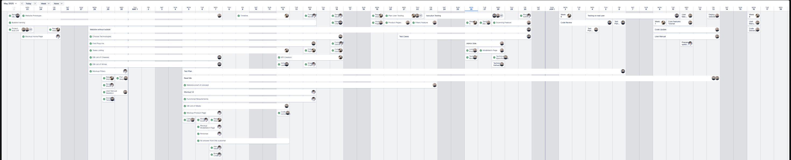
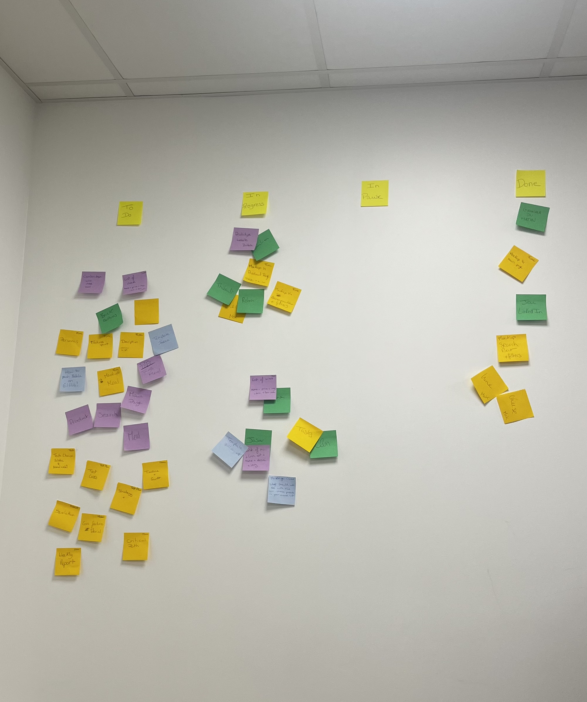

# Weekly Reports - Intermarché Wine & Cheese Recommendation App

## Week 1 Report (April 22–25)

### Summary  
The project began with a joint kickoff that included all eight teams, the client, and the director. The team clarified project objectives and started shaping the user vision for the Intermarché wine and cheese recommendation app. Early work focused on brainstorming and drafting feature ideas.

### Accomplishments

- Project kickoff with all stakeholders
- Brainstorming clarified the core vision:
    - Personalised food & wine pairing
    - Promotion of regional specialities and local producers
    - User-friendly interface, no login required
    - Multilingual access to boost inclusivity
- Feature list exploration and first design ideas
- Technical feasibility research began
- Functional specification drafting initiated

### Challenges

- No project manager present early on, which slowed decision-making
- Confusion within the team about what was a requirement vs. a “nice-to-have”
- Mockups were only started — not yet completed
    
### Status

- On schedule for the May 16 functional spec deadline
- Early-stage alignment and vision completed    

### Planned Next Week

- Finalise mockup design
- Create a clickable prototype in Figma
- Set up GitHub for version control
- Begin creating a Kanban workflow
- Seek client validation on draft ideas

### Conclusion

The first week laid a solid foundation with shared goals and early design ideas. While some coordination issues emerged due to the absence of a project manager, the team stayed aligned with the overall timeline. Clarifying expectations and validating with the client will be crucial in the coming week to ensure smooth progression

## Week 2 Report (April 28–30)

### Summary  
The project regained structure with the return of the project manager. The team finalised the mockup and began creating a prototype in Bubble. Technical concerns were raised about Bubble, prompting discussions about a possible switch to a more efficient technology.

### Accomplishments

- The project manager resumed leadership
- First version of mockup completed
- Bubble prototype created (not yet finished)
- GitHub repository initialised
- Mural Kanban board set up
- Technical alternatives researched (Bubble vs. web app)

### Challenges

- Bubble's free plan revealed major performance limitations
- The client hasn't validated any of the work
- Limited workdays (3 days) due to scheduling

### Status

- Functional spec work is progressing steadily
- The technology direction is still unclear without client input
- The team is aligned and productive despite external constraints

### Planned Next Week

- Enhance the prototype
- Nearly finalise the functional specs
- Try to obtain client validation to unlock development    
- Push further discussion on switching tech stack

### Conclusion

This week marked strong organisational progress, with clearer roles and deliverables. Technical feasibility concerns around Bubble introduced some strategic uncertainty. While the timeline is still on track, client validation is urgently needed to lock in technical decisions and move forward with implementation.

## Week 3 Report (May 5 – 7)

### Summary  
The team made strong progress in documentation, finalising most of the functional specification. The user manual skeleton was structured, and prototype improvements continued. However, the absence of client feedback created a technical and strategic bottleneck.

### Accomplishments

- Functional specifications are nearly finished
- Prototype enriched with core features and pages
- User manual skeleton completed: structure, section titles, and initial design
- Team explored refinement of technical strategy
- Ongoing coordination through the mural Kanban board

### Challenges

- No client response on mockups or specs
- Feedback delay is preventing the final validation of the functional and technical direction
- Prototype can not be finished until the platform is confirmed

### Status

- On schedule, but entering a risk zone if no feedback is received soon
- Functional specs can be delivered if feedback comes in time
- Mockups and tech stack choices remain unvalidated

### Planned Next Week

- Continue requesting client feedback
- Prepare for a potential switch in technology
- Start initial work on technical specifications
- Finalise the prototype
- Maintain the delivery timeline by completing what can be done independently

### Conclusion

The team demonstrated focus and productivity, making significant strides on documentation and the prototype. However, progress is approaching a ceiling due to the absence of client validation. Without timely feedback, technical and design work may need revisions, putting the overall schedule at risk. Next week’s success hinges on unlocking this input.

## Week 4 Report (May 12 – 16)

### Overview

Despite ongoing uncertainty, steady progress was maintained by applying a 3x buffer to all task timelines to anticipate delays. The functional specification was completed and technical specification work was officially initiated. Prototype development was paused pending confirmation on the project's direction.

A meeting with the client was held on Friday, 16 May at 2 PM. During the discussion, it was agreed that the technology stack would be changed, as long as the solution remains functional. The addition of an admin side was acknowledged as part of the original scope, and design details were deprioritised.

### Accomplishments

- The functional specification was completed and delivered on time.
- Work on the technical specification was officially started.
- A client meeting was held and key decisions were confirmed regarding technology and scope.
- Project documentation (timeline, code of conduct, Kanban board) was finalized.
- Risk was managed through timeline adjustments.

### Challenges

- No validation on the mock-ups or functional document was received during the week.
- Uncertainty in the project scope led to a temporary pause in prototype development.
- Refinement of mock-ups was postponed pending feedback from the client.

### Status

- The project remains on schedule due to proactive planning and timeline buffering.
- The functional specification is ready, but its content is at risk of becoming outdated if major feedback is introduced.
- Delivery deadlines are not currently at risk, but content validation remains a key concern.

### Plan for Next Week

- Continue developing the technical specifications.
- Resume and refine prototype development based on clarified scope.
- Begin drafting the test plan.
- Make a final decision on the technology stack, based on the outcomes of the client meeting.

### Conclusion

Although challenges related to scope and feedback persisted, the team adapted effectively by adjusting timelines and maintaining strong internal coordination. The project is still on track, with key deliverables completed and validated decisions from the client helping to clear the way for resumed development next week.

## Week 5 Report (May 19 – 23)

### Overview

This week was dedicated to advancing the technical foundation of the project and preparing for the upcoming testing phase. Two proof of concepts, one in Bubble and one using standard web technologies were largely completed, though design elements are still needing improvements. Technical specifications were finalized in structure, though a few deeper implementation details remain to be addressed.

Efforts were made to reach out to multiple Intermarché locations to arrange real-user testing. A physical testing panel was also created to support and guide the test process.

### Accomplishments

- The proof of concept was developed in both Bubble and web technologies and is currently awaiting design review.
- The technical specifications were completed, with remaining fine details to be finalized.
- Initial testing materials were produced, including the creation of a physical panel to support real-user testing.
- Multiple Intermarché stores were contacted for user testing coordination:
  - **Issoudun**: No response received.
  - **Vierzon**: A response was received; a follow-up is expected on Monday.
  - **Bourges (x2)**: Awaiting responses; follow-up emails were sent.
  - **Mehun-sur-Yèvre**: Declined participation.

### Challenges

- Some fine-grained technical elements still need to be detailed in the specification.
- A lack of response from several stores has delayed the scheduling of real-user tests.
- Team motivation remains moderate due to ongoing uncertainty and waiting periods.

## Status

- Proofs of concept are nearly complete and need design validation.
- Technical specifications are mostly complete but require refinement on a few technical aspects.
- Testing coordination has been initiated with clients but is awaiting final confirmations.

### Plan for Next Week

- Recontact the Intermarché stores that have not yet responded.
- Finalize the remaining details in the technical specifications.
- Make progress on the test plan and define specific test cases.
- Conduct initial testing with real users, if store confirmations are received.
- Continue developing the user manual, focusing on structure and basic instructions.

### Conclusion

This week brought significant advancement on both the technical and operational fronts. With most elements in place for testing and development, the focus now shifts toward final validations and real-user engagement. Once store feedback is confirmed, user testing will begin, enabling valuable insights to be gathered in the following phase.

## Week 6 Report (May 26 – 28)

### Overview

This week was focused on preparing for user testing and addressing technical and design-related challenges. The team continued close coordination with external partners to ensure readiness for real-user evaluations.

### Accomplishments

- User testing was scheduled for the 6th of June at the Intermarché of Bourges.
- Close communication was maintained with the Intermarché of Vierzon to prepare baseline testing activities.
- The testing process was prepared to ensure smooth execution in the coming weeks.

### Challenges

- GitHub issues, including branch conflicts, were encountered and successfully resolved.
- Design elements were identified as still needing improvements based on user feedback and testing readiness reviews.

### Status

- The technical specifications were completed and delivered ahead of schedule.
- The user manual is currently on hold during the testing phase but remains ahead of the planned timeline.
- The alternative website (not built in Bubble) is not ready yet, while the Bubble-based website is fully prepared for testing.
- The test plan has experienced some delays but is expected to be caught up next week.

### Plan for Next Week

- Conduct user testing with real users.
- Finalize and execute the test plan.
- Continue development of the alternative website.
- Update the Bubble website design based on feedback and test findings.

### Conclusion

The alternative website (not built in Bubble) was evaluated too optimistically in last week’s KPIs, which explains the recent drop in the progress curve, but the team remains focused and ready to move forward with testing and refinement.

## Week 7 Report (June 2 – 6)

### Overview

This week was centered around the second round of real-user testing at Intermarché Bourges. Feedback from the first testing session in Vierzon was used to guide initial design improvements. Although testing at Bourges was successfully conducted, its feedback will be reviewed and integrated during the following week. Additionally, the test plan was finalised and delivered on schedule.

### Accomplishments

- User testing was successfully conducted on the 6th of June at Intermarché Bourges:
  - The target audience was defined in more detail.
  - The barcode scanning functionality was tested.
  - Signage was tested for optimal visibility, including evaluation of positioning within the aisles, layout disposition, and size.
  - The team was welcomed to return at any time to conduct additional testing sessions in the store.
- Website design was reviewed and improved based on feedback collected during the first user testing session at Intermarché Vierzon.
- The test plan was completed and delivered as planned.

### Challenges

- A lack of participants from the target demographic limited the breadth of testing insights.
- The product barcode scanning feature did not function as expected during testing. A €40 fee is required to enable this functionality, which was not originally accounted for in the budget.

### Status

- The test plan was finished and delivered on time.
- The user manual remains on hold.
- The project is progressing as expected and remains on schedule, with a buffer built in to accommodate any unforeseen issues.

### Plan for Next Week

- Analyse and integrate feedback from the second user testing session (Bourges).
- Continue user testing with real users.
- Advance the development of the alternative website.
- Begin writing the user manual.

### Conclusion

Despite some budget-related constraints and limited access to the target audience, valuable progress was made through ongoing testing and early design adjustments. The team remains on track and is well-positioned to address upcoming improvements based on Bourges feedback in the following week.

## Week 8 Report (June 10 – 13)

### Overview

This week was dedicated to refining the final components of the project. Efforts were concentrated on completing the user manual, advancing the alternative website, and finalising the Bubble proof of concept. The focus on detail-oriented work marked the final push before delivery.

### Accomplishments

- The user manual was written and significantly progressed toward completion.
- Development of the alternative website was advanced.
- The Bubble version of the application was finalised and prepared for delivery.

### Challenges

- Due to the team’s full focus on final refinements, no additional user testing could be conducted this week.

### Status

- All deliverables are on schedule.
- The project is expected to be delivered ahead of the initial deadline.

### Plan for Next Week

- Last details of the user manual.
- Last details of the proof of concept.
- Finalise the development of the alternative website.
- Preparation for the final presentation.

### Conclusion

The project has entered its final phase with all key elements approaching completion. While additional user testing could not be carried out this week, overall progress remains ahead of schedule, and the team is on track for early delivery.

## Week 9 Report (June 16 – 20)

### Overview

This final project week was dedicated to completing final deliverables, preparing the project presentation, and wrapping up the collaboration. The week marked the official handover of the project to the continuation team and the conclusion of the current team's active involvement.

### Accomplishments

- Final adjustments to the user manual were completed on Monday.
- Final debugging of the Bubble version was carried out on Monday.
- The alternative web application (React version) was finalised.
- The final presentation was prepared and successfully delivered.
- A post-mortem meeting was held to review outcomes, challenges, and lessons learned.

### Challenges

- No major challenges were encountered this week, as all final tasks had been anticipated and addressed in advance.

### Status

- All deliverables were completed on time or ahead of schedule.
- The final presentation was delivered successfully and met expectations.

### Plan for the Future

- Thibaud and Elone will continue the project in collaboration with the Intermarché team.
- The React version of the application will be sent to the client as the finalised delivery.

### Conclusion

The project was concluded successfully, with all goals achieved and the handover process clearly defined. The team delivered a polished final product and left the continuation phase in capable hands, ensuring a smooth transition for future development.

## Post Mortem Report

### What Went Well

- Team cohesion was strong throughout the project, with each member contributing effectively.
- The project was completed on time, and all deliverables were met according to the initial plan.
- The final presentation was well-received and reflected the team's hard work and dedication.
- The use of the Mural Kanban board greatly improved task tracking and overall project visibility.
- Project management was appreciated for providing structure and maintaining team momentum.

### What Didn’t Go Well

- The team was sometimes too restless, leading to occasional miscommunications and minor delays.
- There was no time allocated to improve the design of the proof of concept.
- The design of the proof of concept did not fully reflect the quality of the final product.
- Testing at Saint-Rémy-de-Provence was not feasible due to its distance and logistical challenges.
- No response was received from the Intermarché store in Issoudun despite follow-up attempts.

### What We Learned

- Having a visual management tool like Mural significantly enhances collaboration and task tracking.
- Clear communication and regular check-ins are essential to maintain alignment on project objectives.
- Early and consistent user testing is crucial for identifying usability issues and guiding design improvements.

### Action Items

- Adopt a more disciplined approach to task management and deadlines.
- Equip future project spaces with a TV and AirPlay to facilitate live demonstrations and collaborative reviews.

### Conclusion

This project demonstrated the value of strong team dynamics, structured planning, and consistent effort. While some improvements could have been made in design and communication, the project was a success overall and delivered value to both the client and the team. The React version of the application will be sent to the client as the final delivery. The experience has provided valuable lessons to carry forward into future work.

## KPIs

## Timeline

## Mural Kanban Board

