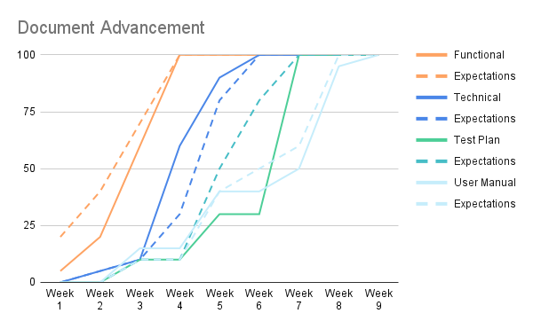
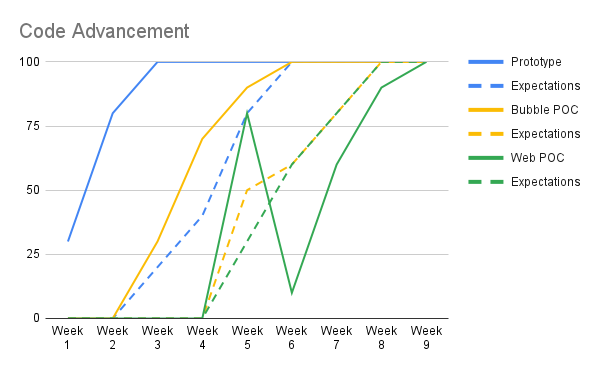

# Weekly Reports - Intermarché Wine & Cheese Recommendation App

## Week 1 Report (April 22–25)

### Summary  
The project began with a joint kickoff that included all eight teams, the client, and the director. The team clarified project objectives and started shaping the user vision for the Intermarché wine and cheese recommendation app. Early work focused on brainstorming and drafting feature ideas.

### Accomplishments

- Project kickoff with all stakeholders
- Brainstorming clarified the core vision:
    - Personalised food & wine pairing
    - Promotion of regional specialities and local producers
    - User-friendly interface, no login required
    - Multilingual access to boost inclusivity
- Feature list exploration and first design ideas
- Technical feasibility research began
- Functional specification drafting initiated

### Challenges

- No project manager present early on, which slowed decision-making
- Confusion within the team about what was a requirement vs. a “nice-to-have”
- Mockups were only started — not yet completed
    
### Status

- On schedule for the May 16 functional spec deadline
- Early-stage alignment and vision completed    

### Planned Next Week

- Finalise mockup design
- Create a clickable prototype in Figma
- Set up GitHub for version control
- Begin creating a Kanban workflow
- Seek client validation on draft ideas

### Conclusion

The first week laid a solid foundation with shared goals and early design ideas. While some coordination issues emerged due to the absence of a project manager, the team stayed aligned with the overall timeline. Clarifying expectations and validating with the client will be crucial in the coming week to ensure smooth progression

## Week 2 Report (April 28–30)

### Summary  
The project regained structure with the return of the project manager. The team finalised the mockup and began creating a prototype in Bubble. Technical concerns were raised about Bubble, prompting discussions about a possible switch to a more efficient technology.

### Accomplishments

- The project manager resumed leadership
- First version of mockup completed
- Bubble prototype created (not yet finished)
- GitHub repository initialised
- Mural Kanban board set up
- Technical alternatives researched (Bubble vs. web app)

### Challenges

- Bubble's free plan revealed major performance limitations
- The client hasn't validated any of the work
- Limited workdays (3 days) due to scheduling

### Status

- Functional spec work is progressing steadily
- The technology direction is still unclear without client input
- The team is aligned and productive despite external constraints

### Planned Next Week

- Enhance the prototype
- Nearly finalise the functional specs
- Try to obtain client validation to unlock development    
- Push further discussion on switching tech stack

### Conclusion

This week marked strong organisational progress, with clearer roles and deliverables. Technical feasibility concerns around Bubble introduced some strategic uncertainty. While the timeline is still on track, client validation is urgently needed to lock in technical decisions and move forward with implementation.

## Week 3 Report (May 5 – 7)

### Summary  
The team made strong progress in documentation, finalising most of the functional specification. The user manual skeleton was structured, and prototype improvements continued. However, the absence of client feedback created a technical and strategic bottleneck.

### Accomplishments

- Functional specifications are nearly finished
- Prototype enriched with core features and pages
- User manual skeleton completed: structure, section titles, and initial design
- Team explored refinement of technical strategy
- Ongoing coordination through the mural Kanban board

### Challenges

- No client response on mockups or specs
- Feedback delay is preventing the final validation of the functional and technical direction
- Prototype can not be finished until the platform is confirmed

### Status

- On schedule, but entering a risk zone if no feedback is received soon
- Functional specs can be delivered if feedback comes in time
- Mockups and tech stack choices remain unvalidated

### Planned Next Week

- Continue requesting client feedback
- Prepare for a potential switch in technology
- Start initial work on technical specifications
- Finalise the prototype
- Maintain the delivery timeline by completing what can be done independently

### Conclusion

The team demonstrated focus and productivity, making significant strides on documentation and the prototype. However, progress is approaching a ceiling due to the absence of client validation. Without timely feedback, technical and design work may need revisions, putting the overall schedule at risk. Next week’s success hinges on unlocking this input.

## Week 4 Report (May 12 – 16)

## Overview

Despite ongoing uncertainty, steady progress was maintained by applying a 3x buffer to all task timelines to anticipate delays. The functional specification was completed and technical specification work was officially initiated. Prototype development was paused pending confirmation on the project's direction.

A meeting with the client was held on Friday, 16 May at 2 PM. During the discussion, it was agreed that the technology stack would be changed, as long as the solution remains functional. The addition of an admin side was acknowledged as part of the original scope, and design details were deprioritised.

## Accomplishments

- The functional specification was completed and delivered on time.
- Work on the technical specification was officially started.
- A client meeting was held and key decisions were confirmed regarding technology and scope.
- Project documentation (timeline, code of conduct, Kanban board) was finalized.
- Risk was managed through timeline adjustments.

## Challenges

- No validation on the mock-ups or functional document was received during the week.
- Uncertainty in the project scope led to a temporary pause in prototype development.
- Refinement of mock-ups was postponed pending feedback from the client.

## Status

- The project remains on schedule due to proactive planning and timeline buffering.
- The functional specification is ready, but its content is at risk of becoming outdated if major feedback is introduced.
- Delivery deadlines are not currently at risk, but content validation remains a key concern.

## Plan for Next Week

- Continue developing the technical specifications.
- Resume and refine prototype development based on clarified scope.
- Begin drafting the test plan.
- Make a final decision on the technology stack, based on the outcomes of the client meeting.

## Conclusion

Although challenges related to scope and feedback persisted, the team adapted effectively by adjusting timelines and maintaining strong internal coordination. The project is still on track, with key deliverables completed and validated decisions from the client helping to clear the way for resumed development next week.

### KPIs

