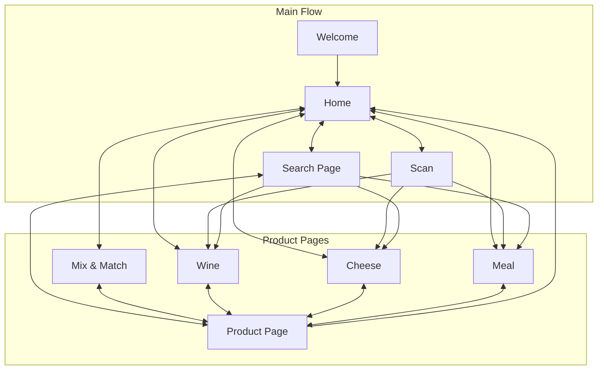
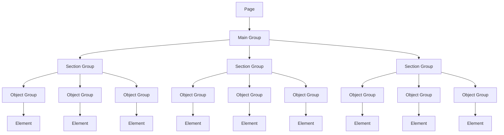
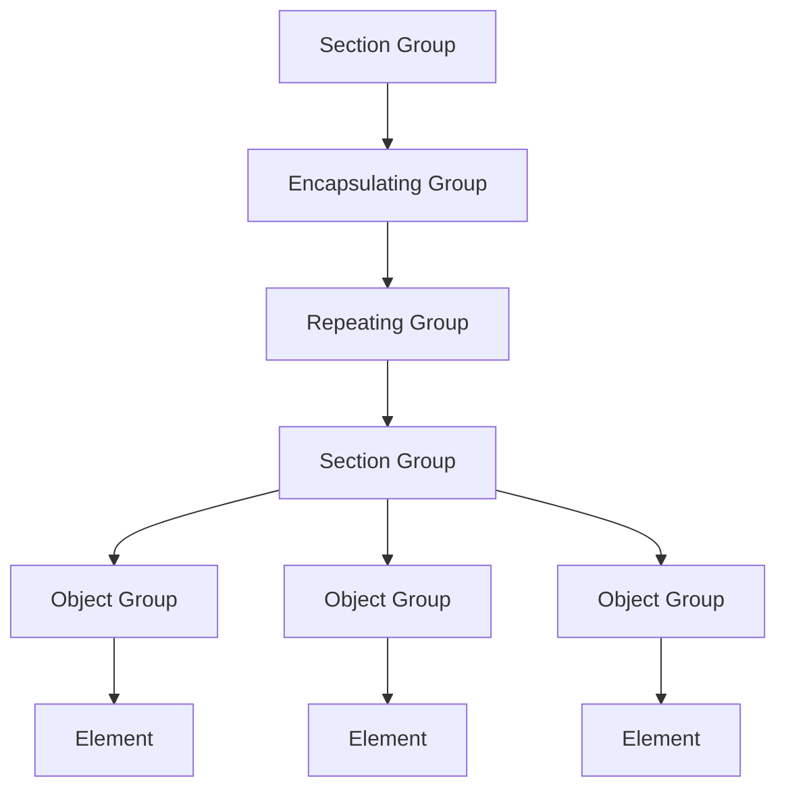

# Technical Specifications

## Table of Contents

## Overview

This document outlines the technical specifications for this project. It includes details about the architecture, technologies used, and any other relevant technical information.
The goal is to provide a comprehensive understanding of the technical aspects of the project for developers, architects, and stakeholders.

### Context

The goal of this project is to deliver a user-friendly **mobile application** for Intermarché customers, providing personalized assistance when choosing wine and/or cheese upon entering the store.
The app will suggest the most suitable wine or cheese based on the user's dish, taste preferences, or filters. It aims to simplify the selection process and enhance customer satisfaction by offering tailored recommendations.

> For more information about the project, please refer to the [Functional Specifications](../functional/FunctionalSpecifications.md) document.

### Conventions

You can find the detailed conventions in the [Conventions](./Conventions.md) document.

---

## Bubble.io

This project was created on Bubble.io, a no-code platform that allows users to build web applications without writing code.
Bubble.io provides a visual interface for designing and developing applications, making it accessible to non-technical users while still offering powerful features for developers.
Bubble.io is built on a robust architecture that supports scalability, security, and performance. It uses a combination of technologies, including:

- **JavaScript**: The primary programming language used for client-side scripting and interactivity.
- **HTML/CSS**: The standard markup and styling languages for web development.
- **PostgreSQL**: The database management system used for data storage and retrieval.
- **Node.js**: The server-side runtime environment for executing JavaScript code on the server.
- **AWS**: Amazon Web Services is used for cloud hosting and storage, providing scalability and reliability.
- **RESTful APIs**: The architecture for building web services that allow communication between different parts of the application.
- **GraphQL**: A query language for APIs that allows clients to request only the data they need, improving performance and reducing bandwidth usage.
- **WebSockets**: A protocol for full-duplex communication channels over a single TCP connection, enabling real-time data exchange between the client and server.

### Plugins

Bubble.io supports a wide range of plugins that extend the functionality of the platform.
These plugins can be used to integrate third-party services, add new features, and enhance the user experience. Some of the key plugins used in this project include:

- **Barcode Scanner**: A plugin that allows users to scan barcodes using their device's camera. This is useful to scan products.
- **API Connector**: A plugin that enables integration with external APIs, allowing the application to communicate with other services and retrieve data.
- **Google Material Icons**: A plugin that provides access to a library of icons for use in the application, enhancing the visual design and user interface.
- **Language Translation**: A plugin that enables translation of text within the application, allowing for multilingual support and accessibility for users in different regions.

---

## Architecture

### Application Architecture

The application follows a modular archtecture, with each page (in Bubble) reprsenting a page in the app.
All pages in the application are interconnected, ensuring seamless navigation.

#### Flow

The Users arrive on the **Welcome** page, here they can choose their language (by default French) and then they are redirected to the **Home** page.
Once on the **Home** page, they have access to multiple features:

- **Scan**: Users can scan a product's barcode to get more information about it.
- **Search Page**: Users can search for a product by name or filter by type (wine, cheese, meal).
- **The Different Product Pages**: Users can access the different product pages (wine, cheese, meal) to explore the available products.
- **Mix & Match**: Users can explore the different combinations of wine, cheese and meal.

If the User wants more information on a specific product, he can click on it and he will be redirected onto the corresponding **Product Page**.

### Page Architecture

The application being built using Bubble.io, the pages are built following the Bubble.io conventions; as such, each page has a main group that encapsulates the entire page.
The main group contains the different sections of the page, which are further divided into groups and again into elements.
The page architecture is as follows:

This page architecture clearly defines the hierarchy of the page, with the main group containing all the sections and objects.
Each section group contains multiple object groups, which in turn contain various elements.
The elements can be buttons, text, images, inputs, etc. This modular approach allows for easy maintenance and updates to the application.

#### Repeating Groups

In Bubble.io, repeating groups are used to display lists of items dynamically. Each repeating group contains a group that encapsulates the different sections and objects of the repeating group.

The structure is different for pages containing repreating groups: the repeating group is encapsulated in a group, and contains a group that contains the different sections and objects of the repeating group.

> Note: In the case that the repeating group only contains one element(e.g. a text), their is no need to have a section group and an object group inside the reeating group.

### Database Design

The database contains infomation about wines, cheeses and meals; includings their names, origin and other relevant details.

The database contains the following files:

- **wines.json**: Specify the wines available in the store, including their ITM8, EAN, name, region, country, year, type, grape, price, rating, description(fr and en), image and indicating if the wine is a best seller,
- **cheeses.json**: Specify the cheeses available in the store, including their ITM8, EAN, name, region, country, type, milk, price, rating, description(fr and en), image and indicating if the cheese is a best seller,
- **meal.json**: Specify a selection of French meals that can be paired with wine and cheese, including their name, recipe, description(fr and en), image, a list of allergens and a list of wines and cheeses that they can be paired with,
- **Data - Wine and Cheese.xlsx**: A spreadsheet given by Intermarché containing the wines and cheeses available in the store, including their ITM8, EAN, name, prix de vente

> The database can be found in the [data](../../data/) folder.
> Some additional information about the database can be found in the [README](../../data/README.md) of the database.

---

## Security

Our Application does not keep any data from the users. As such we are compliant with the GDPR and CCPA regulations.

---

## Performance Optimization

To ensure a smooth and responsive user experience, the following performance optimization techniques have been applied:

- **Lazy Loading**: Resources such as images and scripts are loaded only when needed to reduce initial load time.
- **Caching**: Frequently accessed data is cached on both the client and server sides to minimize database queries and improve response times.
- **Database Indexing**: Indexes have been created on frequently queried fields to speed up database operations.
- **Content Delivery Network (CDN)**: Static assets such as images, CSS, and JavaScript files are served through a CDN to reduce latency and improve load times.
- **Real-Time Updates**: WebSockets are used for real-time updates, reducing the need for frequent polling and improving performance.

---

## Testing and Quality Assurance

To ensure the reliability and quality of the application, a comprehensive testing strategy has been implemented, find it in the [Test Plan](../QA/TestPLan.md)

---

## Deployment and Maintenance

The deployment and maintenance strategy for the application includes:

- **Continuous Integration/Continuous Deployment (CI/CD)**: Automated pipelines are used to build, test, and deploy the application, ensuring rapid and reliable updates.
- **Monitoring and Logging**: Tools such as AWS CloudWatch and Bubble.io's built-in monitoring features are used to track application performance and identify issues in real-time.
- **Regular Updates**: The application is regularly updated to include new features, fix bugs, and address security vulnerabilities.
- **Documentation**: Comprehensive documentation is maintained to assist developers and stakeholders in understanding the application and its architecture.

---

## Future Enhancements

To ensure the application remains relevant and continues to meet user needs, the following future enhancements are planned:

- **AI-Powered Recommendations**: Integrating machine learning algorithms to provide more accurate and personalized wine and cheese recommendations.
- **Offline Mode**: Allowing users to access certain features of the application without an internet connection.
- **Expanded Product Database**: Continuously updating the database to include more wine and cheese options.
- **Enhanced Analytics**: Providing store managers with detailed analytics on customer preferences and trends to improve inventory management.

---
