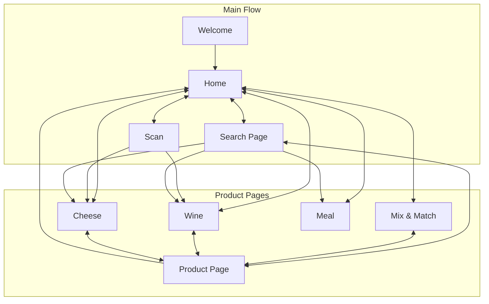
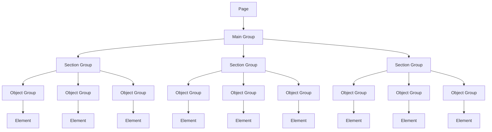
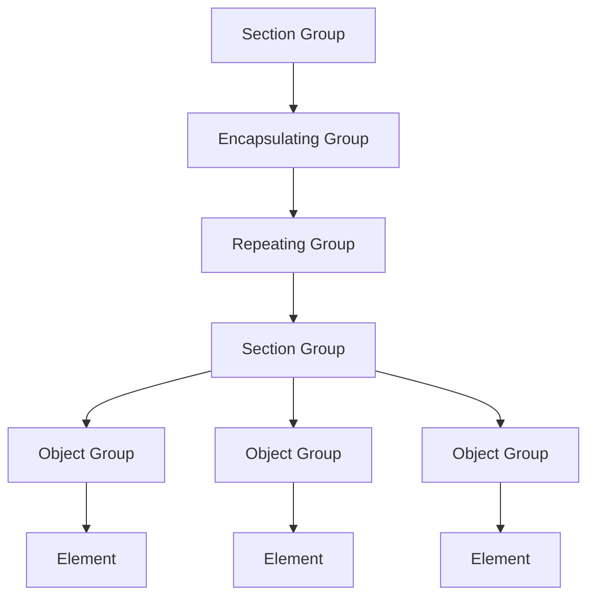
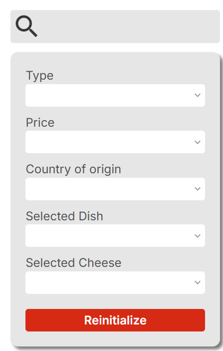
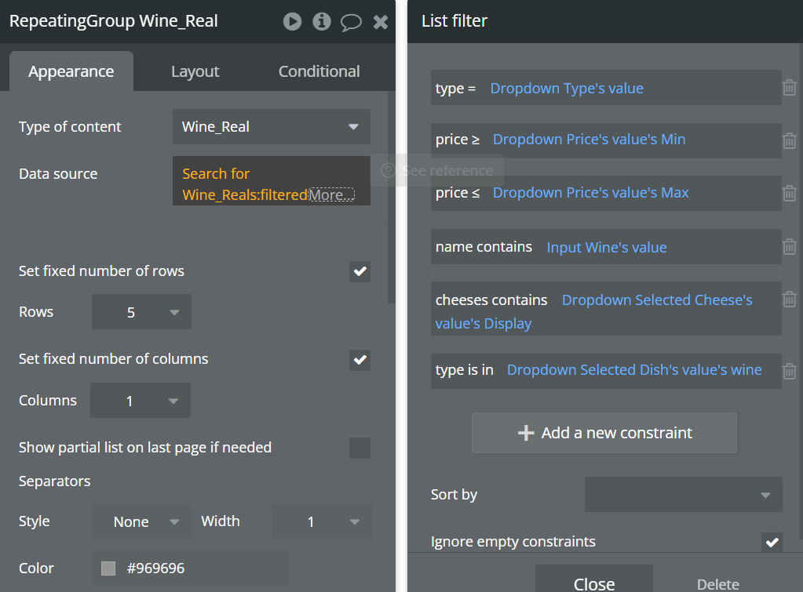

<div align="center">

# Technical Specifications

</div>

## Table of Contents

<details>

<summary>Click to expand</summary>

- [Technical Specifications](#technical-specifications)
  - [Table of Contents](#table-of-contents)
  - [Overview](#overview)
    - [Context](#context)
    - [Conventions](#conventions)
  - [Bubble.io](#bubbleio)
    - [Plugins](#plugins)
    - [Limitations](#limitations)
  - [Architecture](#architecture)
    - [Website Architecture](#website-architecture)
      - [Flow](#flow)
    - [Page Architecture](#page-architecture)
      - [Repeating Groups](#repeating-groups)
    - [Database Design](#database-design)
      - [Examples](#examples)
        - [Wine](#wine)
        - [Cheese](#cheese)
        - [Meal](#meal)
    - [Searching and Filtering](#searching-and-filtering)
  - [Security](#security)
  - [Performance](#performance)
    - [Optimization](#optimization)
    - [Bubble.io Optimization](#bubbleio-optimization)
  - [Testing and Quality Assurance](#testing-and-quality-assurance)
  - [Deployment and Maintenance](#deployment-and-maintenance)
  - [Future Enhancements](#future-enhancements)

</details>

---

## Overview

This document outlines the technical specifications for developing a **mobile web application** for Intermarché, titled Cheerish. Its objective is to define the project’s technical requirements, architecture, and technologies, ensuring all stakeholders share a unified understanding of what is being developed.

### Context

The goal of this project is to deliver a users-friendly **mobile web application** for Intermarché customers, providing personalized assistance when choosing wine and/or cheese upon entering the store.
The website will suggest the most suitable wine or cheese based on the users's dish, taste preferences, or filters. It aims to simplify the selection process and enhance customer satisfaction by offering tailored recommendations.

> For more information about the project, please refer to the [Functional Specifications](../functional/FunctionalSpecifications.md) document.

### Conventions

You can find the detailed conventions in the [Conventions](./Conventions.md) document.

---

## Bubble.io

The website was created on Bubble.io, a no-code platform that allows users to build web applications without writing code.
Bubble.io provides a visual interface for designing and developing websites, making it accessible to non-technical users while still offering powerful features for developers.
Bubble.io is built on a robust architecture that supports scalability, security, and performance.

### Plugins

Bubble.io supports a wide range of plugins that extend the functionality of the platform.
These plugins can be used to integrate third-party services, add new features, and enhance the users experience. Some of the key plugins used in this project include:

| Plugin | Description |
| --- | --- |
| **Bubble API Connector** | A plugin that allows the website to connect to external APIs, enabling data retrieval and integration with other services. |
| **Barcode Scanner** | A plugin that enables the website to scan barcodes using the device's camera, allowing users to quickly access product information. |
| **Google Material Icons** | A plugin that provides access to a library of icons for use in the website, enhancing the visual design and users interface. |
| **Language Translation** | A plugin that enables the website to translate text into different languages, allowing for multilingual support and accessibility. |

### Limitations

While Bubble.io is a powerful platform, it does have some limitations that developers should be aware of:

| **Limitations** | **Description** |
| --- | --- |
| **Performance** | Bubble.io websites can experience performance issues with large datasets or complex workflows. Developers should optimize their websites to minimize load times and improve responsiveness. |
| **Customization** | While Bubble.io allows for a high degree of customization, there may be limitations in terms of advanced features or specific design elements that require custom code. |
| **Vendor Lock-In** | websites built on Bubble.io are tied to the platform, which may limit flexibility and portability in the future. Developers should consider this when planning for long-term maintenance and scalability. |
| **Learning Curve** | While Bubble.io is designed to be users-friendly, there may still be a learning curve for new users, especially those who are not familiar with web development concepts. Developers should invest time in learning the platform and its features to maximize its potential. |
| **Cost** | Bubble.io operates on a subscription model, and costs can increase as the website scales or requires additional features. Developers should carefully consider their budget and plan for future expenses. |
| **Limited Control Over Infrastructure** | As a no-code platform, developers have limited control over the underlying infrastructure and may not be able to implement certain optimizations or configurations that are possible with traditional development approaches. |
| **Integration Challenges** | While Bubble.io supports API integrations, there may be challenges in connecting with certain third-party services or handling complex data structures. Developers should thoroughly test integrations to ensure compatibility and reliability. |
| **Security Concerns** | While Bubble.io provides security features, developers should be aware of potential vulnerabilities and take necessary precautions to protect users data and privacy. This includes implementing secure authentication, data encryption, and regular security audits. |
| **Limited Offline Support** | Bubble.io websites are primarily web-based and may not provide robust offline support. Developers should consider this when designing features that require offline access or functionality. |
| **Dependency on Bubble.io** | The website is dependent on the Bubble.io platform, which means that any changes or updates to the platform may impact the website's functionality or performance. Developers should stay informed about platform updates and be prepared to adapt their websites as needed. |
| **Limited Custom Code** | While Bubble.io allows for some custom code, it may not support all programming languages or frameworks. Developers should be aware of these limitations when planning for advanced features or integrations. |
| **Limited Testing and Debugging Tools** | Bubble.io provides some testing and debugging tools, but they may not be as comprehensive as those available in traditional development environments. Developers should be prepared to rely on manual testing and troubleshooting to identify and resolve issues. |
| **Limited Community Support** | While Bubble.io has a growing community, it may not have the same level of support and resources as more established development platforms. Developers should be proactive in seeking help and sharing knowledge within the community. |
| **Limited Scalability** | While Bubble.io is designed to handle a wide range of websites, there may be limitations in terms of scalability for very large or complex websites. Developers should carefully consider their website's growth potential and plan accordingly. |
| **Limited Control Over Updates** | Bubble.io regularly updates its platform, which may introduce changes that affect existing websites. Developers should stay informed about updates and be prepared to adapt their websites as needed. |
| **Limited Customization of users Interface** | While Bubble.io provides a range of design options, there may be limitations in terms of customizing the users interface to match specific branding or design requirements. Developers should carefully consider their design needs and explore available options within the platform. |
| **Limited Support for Advanced Features** | While Bubble.io supports a wide range of features, there may be limitations in terms of implementing advanced functionality such as machine learning, artificial intelligence, or complex data processing. Developers should carefully consider their website's requirements and explore available options within the platform. |

---

## Architecture

### Website Architecture

The website follows a modular architecture, with each page (in Bubble) representing a page in the website.
All pages in the website are interconnected, ensuring seamless navigation.

#### Flow



The users arrive on the **Welcome** page, here they can choose their language (by default French) and then they are redirected to the **Home** page.
Once on the **Home** page, they have access to multiple features:

- **Scan**: users can scan a product's barcode to get more information about it.
- **Search Page**: users can search for a product by name or filter by type (wine, cheese, meal).
- **The Different Product Pages**: users can access the different product pages (wine, cheese, meal) to explore the available products.
- **Mix & Match**: users can explore the different combinations of wine, cheese and meal.

If the users wants more information on a specific product, he can click on it and he will be redirected onto the corresponding **Product Page**.

### Page Architecture

The website being built using Bubble.io, the pages are built following the Bubble.io conventions; as such, each page has a main group that encapsulates the entire page.
The main group contains the different sections of the page, which are further divided into groups and again into elements.
The page architecture is as follows:



This page architecture clearly defines the hierarchy of the page, with the main group containing all the sections and objects.
Each section group contains multiple object groups, which in turn contain various elements.
The elements can be buttons, text, images, inputs, etc. This modular approach allows for easy maintenance and updates to the website.

#### Repeating Groups

In Bubble.io, repeating groups are used to display lists of items dynamically. Each repeating group contains a group that encapsulates the different sections and objects of the repeating group.

The structure is different for pages containing repeating groups: the repeating group is encapsulated in a group, and contains a group that contains the different sections and objects of the repeating group.



> Note: In the case that the repeating group only contains one element(e.g. a text), their is no need to have a section group and an object group inside the repeating group.

### Database Design

The database contains information about wines, cheeses and meals; including their names, origin and other relevant details.

The database contains the following files:

- **wines.json**: Specify the wines available in the store, including their ITM8, EAN, name, region, country, year, type, grape, price, rating, description(fr and en), image and indicating if the wine is a best seller,
- **cheeses.json**: Specify the cheeses available in the store, including their ITM8, EAN, name, region, country, type, milk, price, rating, description(fr and en), image and indicating if the cheese is a best seller,
- **meal.json**: Specify a selection of French meals that can be paired with wine and cheese, including their name, recipe, description(fr and en), image, a list of allergens and a list of wines and cheeses that they can be paired with,
- **Data - Wine and Cheese.xlsx**: A spreadsheet given by Intermarché containing the wines and cheeses available in the store, including their ITM8, EAN, name, prix de vente

> The database can be found in the [data](../../data/) folder.
> Some additional information about the database can be found in the [README](../../data/README.md) of the database.

#### Examples

<details>

<summary>Click to expand</summary>

##### Wine

```json
{
  "id": 1,
  "ITM8": "0000099056669",
  "EAN": "3760076070020",
  "name": "Domaine de Valdition Rosé Tradition",
  "region": "Alpilles",
  "country": "France",
  "year": 2023,
  "type": "Rosé",
  "grape": "Vermentino, Shiraz/Syrah, Cabernet Sauvignon, Grenache, Cinsault",
  "price": 10.5,
  "rating": 3.7,
  "description_fr": "Couleur pâle aux reflets rosés. Nez floral et élégant avec des arômes de baies rouges. Frais et fruité en bouche.",
  "description_en": "Pale colour with pink hues. Floral and elegant nose with red berry aromas. Fresh and fruity on the palate.",
  "image": "https://raw.githubusercontent.com/algosup/2024-2025-project-5-bubble-intermarche-team-4/refs/heads/main/data/images-wines/Valdition_Rose.png",
  "bestseller": false,
  "cheese": [
    "Goat's cheese",
    "Semi-hard cheese"
  ],
  "alcohol_percentage": 12.0
},
```

##### Cheese

```json
{
  "id": 1,
  "ITM8": "0000099006106",
  "EAN": "0205010000000",
  "name": "Chèvre nature ou aromatisé",
  "region": "France",
  "country": "France",
  "type": "Fresh cheese",
  "milk": "Goat",
  "price": 3.6,
  "rating": null,
  "description_fr": "Fromage de chèvre frais fabriqué à partir de lait de chèvre, crémeux et légèrement acidulé, disponible nature ou aromatisé.",
  "description_en": "Fresh goat cheese made from goat's milk, creamy and slightly tangy, available plain or flavored.",
  "image": "https://raw.githubusercontent.com/algosup/2024-2025-project-5-bubble-intermarche-team-4/refs/heads/main/data/images-cheeses/chevre-nature.jpg",
  "bestseller": true,
  "wine": [
    "White"
  ],
  "crust_type": "Speciality - Chèvre frais",
  "crust_type_en": "Specialty - Fresh goat cheese"
},
```

##### Meal

```json
{
  "id": "1",
  "name": "Boeuf Bourguignon",
  "link": "https://www.allrecipes.com/recipe/256165/boeuf-bourguignon/",
  "description_fr": "Un plat traditionnel français à base de bœuf mijoté dans du vin rouge, des oignons et des champignons.",
  "description_en": "A traditional French dish made with beef stewed in red wine, onions, and mushrooms.",
  "region": "Bourgogne",
  "allergen": [
    "gluten",
    "lactose"
  ],
  "wine": [
    "Red"
  ],
  "cheese": [
    "Fresh cheese",
    "goat cheese"
  ],
  "image": "https://raw.githubuserscontent.com/algosup/2024-2025-project-5-bubble-intermarche-team-4/refs/heads/documents/data/images-meals/Boeuf_Bourguignon.jpg"
},
```

> Note: the "image" field's links are in such format for ease of implementation in the website.

</details>

### Searching and Filtering

The website allows users to search for wines, cheeses and meals using different filters. The search functionality is implemented using the Bubble.io's built-in search capabilities, which allows for efficient querying of the database.



>This is the design for when the users have selected they wanted to search for a wine.
>The design for the cheese and meal search pages is similar.

The search page is divided in two sections: a search bar + filters section and a product display section.

The first section allows the user to either search for a specific product by name or filter the producs to with specific criterias using an input field and multiple dropdown menus to select prefered characteristics.

The second part displays the products that match the search criteria. The products are displayed in a repeating group, which allows for dynamic loading of products based on the search results.

As for **How** the search is done:

The input field is set to search for the name of the product in the database.

The dropdown menus are set to display a specific field of the database (e.g. the type of wine, the price range).

The repeating group is set to display the products that match the search criteria, to do so it displays a filtered list of the database based on the input field and the dropdown menus(any empty field is ignored) as shown below:



---

## Security

The website is a login and cookie free website that does not store any personal data of the users.
Moreover the website does not use any third-party services that would require the collection of personal data.
As such the website adheres to the GDPR regulations.

---

## Performance

The website has to be performant and responsive to ensure a smooth users experience.
As such we have the following pre-requisites:

- The **search queries** should be kept under 1 seconds,
- the **recomandation results** should be displayed under 1 seconds.

To achieve this, we have implemented the different stategies as described below.

### Optimization

To ensure a smooth and responsive users experience, the following performance optimization techniques have been applied:

- **Lazy Loading**: Resources such as images and scripts are loaded only when needed to reduce initial load time.
- **Caching**: Frequently accessed data is cached on both the client and server sides to minimize database queries and improve response times.
- **Database Indexing**: Indexes have been created on frequently queried fields to speed up database operations.
- **Content Delivery Network (CDN)**: Static assets such as images, CSS, and JavaScript files are served through a CDN to reduce latency and improve load times.
- **Real-Time Updates**: WebSockets are used for real-time updates, reducing the need for frequent polling and improving performance.

### Bubble.io Optimization

In order to optimize the performance of the website, the following strategies have been applied:

- **Minimize Workflows**: The number of workflows triggered on page load or users actions has been minimized to reduce server load and improve response times.
- **Optimize Data Calls**: Data calls to the database have been optimized to retrieve only the necessary data, reducing the amount of data transferred and improving performance.
- **Use of Custom States**: Custom states are used to store temporary data on the client side, reducing the need for server calls and improving performance.
- **Nested Repeating Groups**: Nested repeating groups are avoided where possible to reduce complexity and improve performance.

---

## Testing and Quality Assurance

To ensure the reliability and quality of the website, a comprehensive testing strategy has been implemented to ensure that all features and functionalities work as intended and that the website is free of defects before delivery to the client.

You can find the more information about the testing strategy in the [Test Plan](../QA/TestPlan.md) document.

---

## Deployment and Maintenance

The deployment and maintenance strategy for the website includes:

- **Monitoring and Logging**: Tools such as Bubble.io's built-in monitoring features are used to track website performance and identify issues in real-time.
- **Regular Updates**: The website is regularly updated to include new features, fix bugs, and address security vulnerabilities.
- **Documentation**: Comprehensive documentation is maintained to assist developers and stakeholders in understanding the website and its architecture.

---

## Future Enhancements

To ensure the website remains relevant and continues to meet users needs, the following future enhancements are planned:

- **AI-Powered Recommendations**: Integrating machine learning algorithms to provide more accurate and personalized wine and cheese recommendations.
- **Offline Mode**: Allowing users to access certain features of the website without an internet connection.
- **Expanded Product Database**: Continuously updating the database to include more wine and cheese options.
- **Enhanced Analytics**: Providing store managers with detailed analytics on customer preferences and trends to improve inventory management.
- **Special Offers and Promotions**: Implementing a system for notifying users of special offers and promotions on wine and cheese products.
- **Users Feedback and Ratings**: Allowing users to provide feedback and rate products to improve recommendations and users experience.
- **In Store Guidance**: Implementing a feature that guides users to the location of their selected products within the store.

---
