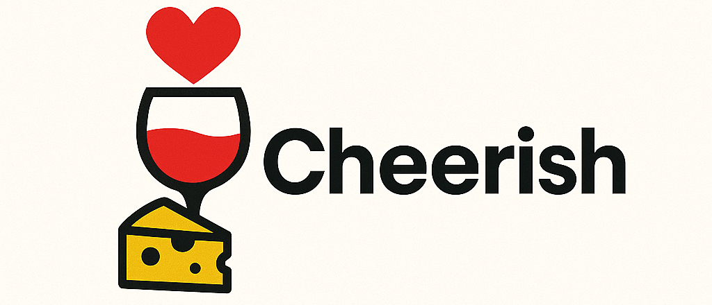
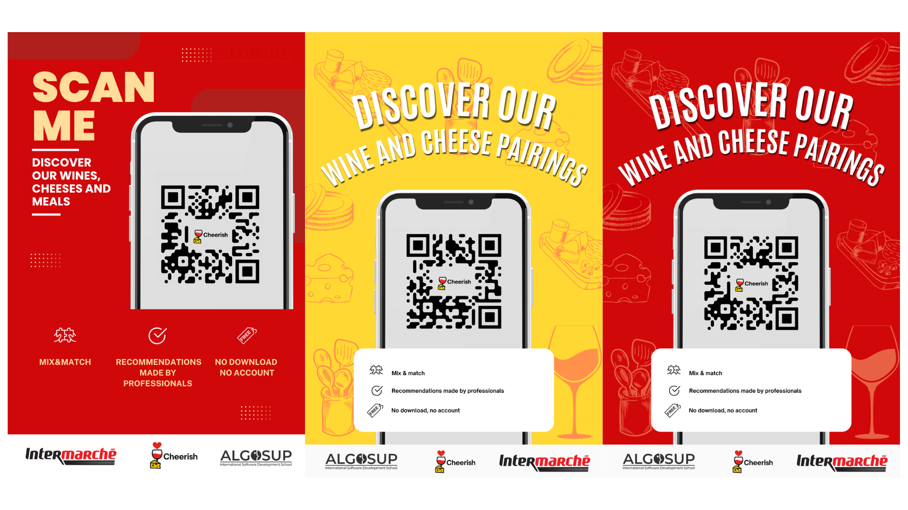
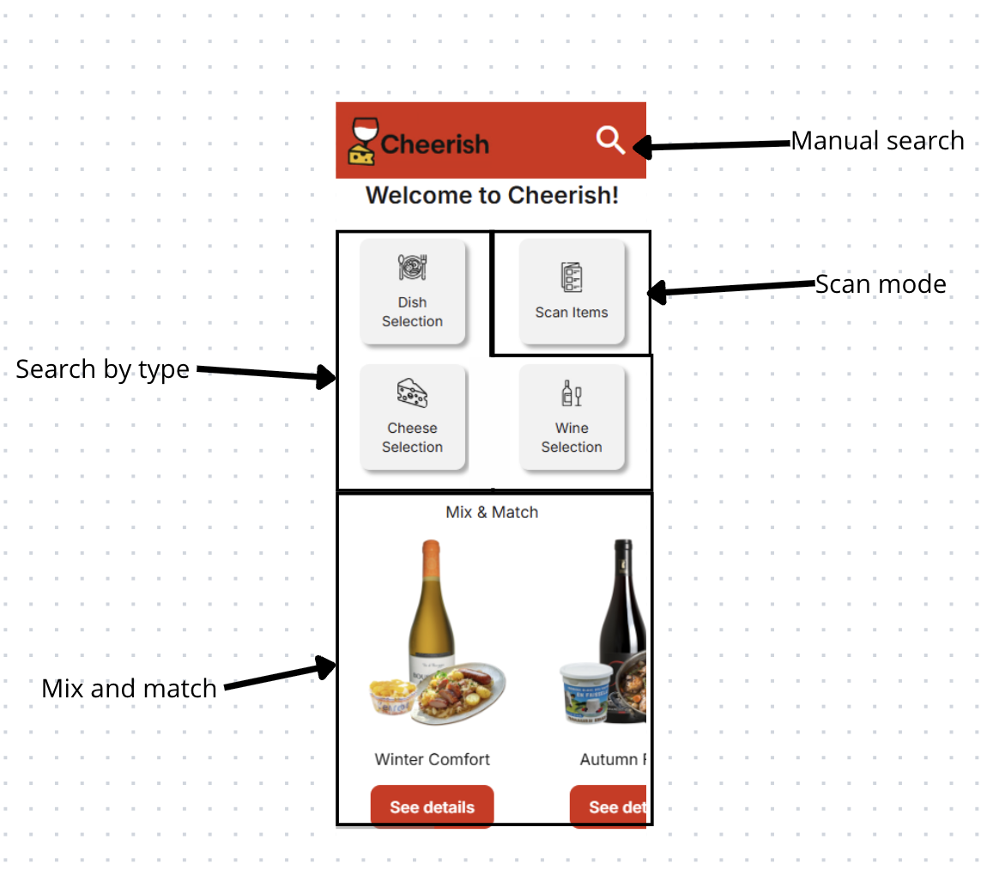
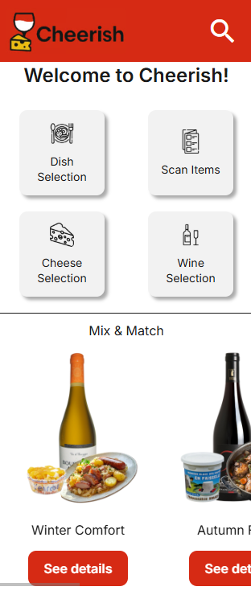
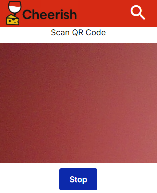
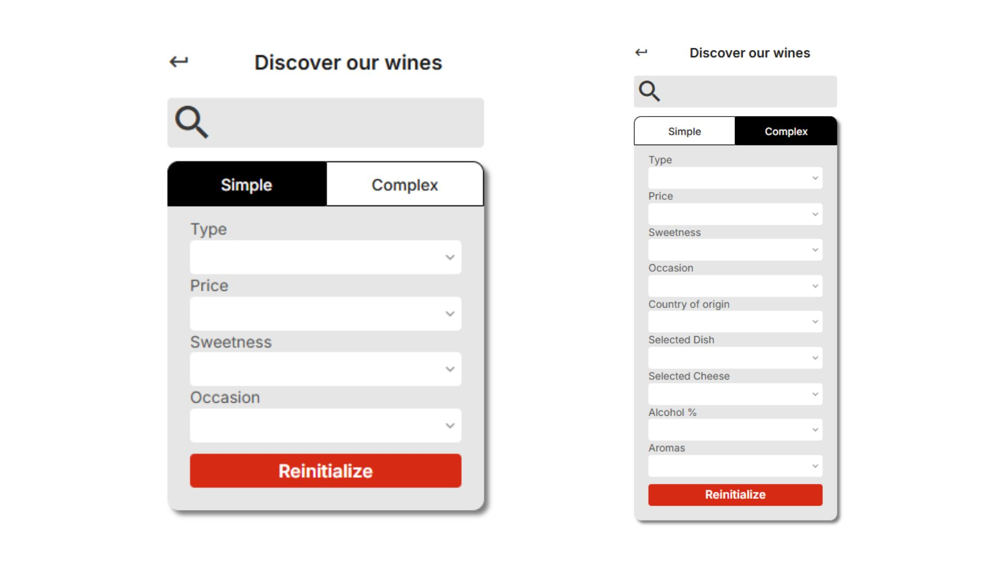
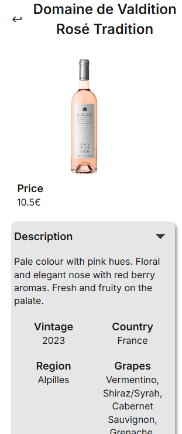
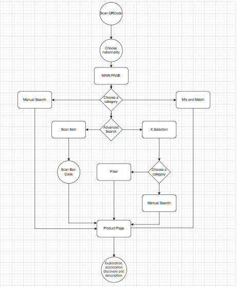

# User Manual - Cheerish

  

<b>Table Of Contents</b>

- [User Manual - Cheerish](#user-manual---cheerish)
  - [Introduction](#introduction)
    - [What is Cheerish?](#what-is-cheerish)
    - [Audience](#audience)
    - [Scope](#scope)
    - [Prerequisites](#prerequisites)
    - [Objectives](#objectives)
  - [Starting Guide](#starting-guide)
    - [QR Code Scan](#qr-code-scan)
    - [Installation Steps](#installation-steps)
    - [Setup](#setup)
  - [Usage Guide](#usage-guide)
    - [Navigation](#navigation)
    - [Search](#search)
    - [Product Page](#product-page)
    - [Use Case](#use-case)
  - [Support \& Troubleshooting](#support--troubleshooting)
    - [Common Issues](#common-issues)
    - [How to Report a Bug](#how-to-report-a-bug)
  - [FAQs](#faqs)
  - [Legal Mentions](#legal-mentions)
    - [Copyright](#copyright)
    - [Licence \& Usage](#licence--usage)
    - [Liability Disclaimer](#liability-disclaimer)
    - [Modifications and Updates](#modifications-and-updates)
    - [Contact Information](#contact-information)

## Introduction

### What is Cheerish?

Cheerish is a website developed for Intermarché to enhance the shopping experience by offering personalized content and helping users discover and pair wines, cheeses, and dishes.

### Audience

This user manual is intended for everyone, with no technical knowledge or computer experience required. The application offers a user-friendly interface designed specifically for Intermarché customers.

### Scope

This document explains how to access, navigate, and use Cheerish, covering all features accessible to users.

Cheerish primarily promotes traditional cheeses, wines, and recipes, especially aimed at foreign visitors seeking local food experiences.

### Prerequisites 

- A smartphone
- Internet access (mobile data or Wi-Fi)
- QR code access from an Intermarché store
- Updated browser

### Objectives

- Help users use the solution
- Explain core features
- Provide troubleshooting support for common issues

## Starting Guide

### QR Code Scan

1. Open your phone's camera or a QR scanning app.
2. Scan the QR code available in the Intermarché store or on promotional material.
3. Tap the link that appears.

There are three different QR codes:
- Main Avenue QR: Redirects to the general website interface
- Cheese Aisle QR: Opens a personalized cheese selection
- Wine Aisle QR: Opens a personalized wine selection

 

  

### Installation Steps

The application requires no installation. Once the QR code is scanned, the app opens directly in your mobile browser.

### Setup

At launch, users can select their language (bottom-left corner) and fill out a short form to receive personalized recommendations.

## Usage Guide

### Navigation

From the home page, you can choose between:
- Dish Selection.
- Cheese Selection.
- Wine Selection.
- Scan Items.

**Scan Feature**:

Use your camera to scan a barcode on a product package to find matching suggestions (e.g. scan a cheese to find the perfect wine).

**Mix & Match**:

This section shows suggested combinations (wine + dish, dish + cheese, etc.) with seasonal ideas to help users create memorable meals.

 

  

### Search

- Manual Search: Enter keywords or product names in the search bar.
- Scan Barcode: Scan to access product details, prices, and pairings.
- Apply Filters: Refine results by product type, price, origin, or season,...

**Manual Search**

Quickly find products by entering keywords, product names, or categories in the search bar.

 

  

**Scan Bar Code**

Use your device’s camera to scan product barcodes and instantly access detailed information, prices, and pairings.

 

  

**Add Filters**

Refine your search results by applying filters such as price range, type of product, country of origin, and season.
There are both simple and advanced search options with filters, allowing users to benefit from a flexible interface based on their experience and needs.

 

  

### Product Page

The product page contains all the information related to the item, depending on the category, whether it is cheese or wine. 

 

  

### Use Case

**Bringing the Right Wine for a Cheese**

**Title**: Selecting a wine to pair with cheese for an upcoming event.
**Primary Actor**: Guest (novice in wine & cheese pairing).
**Goal**: Confidently choose a wine that pairs well with a known cheese.

Scenario:
1. Scan the QR code in the supermarket.
2. Select your nationality on the pop-up.
3. Choose "Manual Search" or “Cheese Selection” on the homepage.
4. Search for the cheese.
5. View pairing suggestions, including recommended wines.

 

  

## Support & Troubleshooting

### Common Issues
| Issue | Solution |
| ----- | -------- |
| App won’t open	| Try scanning again with a different browser or update it |
| QR code not working	| Retry scanning the QR or contact support |

### How to Report a Bug

To report a bug or request help, contact: cheerish.support@gmail.com.
Please include:
- A description of the issue.
- Screenshots or screen recordings if possible.
- The QR code you scanned.

*While we aim to assist every user, we cannot guarantee the resolution of all issues.*

## FAQs

| Questions                                            | Solutions                                                                 |
|------------------------------------------------------|---------------------------------------------------------------------------|
| Is user data stored?                                 | No Cheerish does not store any personal data.                             |
| Does the application require an Internet connection? | Yes, mobile data or WI-FI is required.                                    |
| Are all Intermarché products available?              | No, only selected wines and cheeses are featured.                         |
| Can I order or reserve products?                     | No, the application is for information only; no online orders, reservations, or purchases are possible. |
| How can I report a bug or anomaly?                   | Refer to the “Contact information” section in this documentation.         |

## Legal Mentions

### Copyright

All content (text, images, diagrams, code) is the intellectual property of Cheerish and protected under copyright law.

© 2025 ALGOSUP. All rights reserved.

### Licence & Usage

This document is for educational and informational use only. It may not be copied, shared, or used commercially without written consent from Cheerish.
Protected by international frameworks, including:

- The Berne Convention
- EU Directive 2001/29/EC

### Liability Disclaimer

This software and its associated documentation are provided by Cheerish free of charge and without the collection of personal data.
The software is provided “as is”, without any express or implied warranties. This includes, but is not limited to, warranties of merchantability, fitness for a particular purpose, or non-infringement.

Although Cheerish makes efforts to ensure the accuracy and stability of the software, no guarantee is given regarding its uninterrupted or error-free operation.
Users assume full responsibility for their use of the software. Cheerish shall not be held liable for any direct, indirect, or incidental damages resulting from its use, except in cases of gross negligence or wilful misconduct.

### Modifications and Updates

Cheerish reserves the right to modify, update, or remove any part of its services, including documents and software, at any time without prior notice.

### Contact Information

For inquiries regarding the document, its usage, or any legal matters, please contact Cheerish through the official ALGOSUP communication channels.

 

  
  

